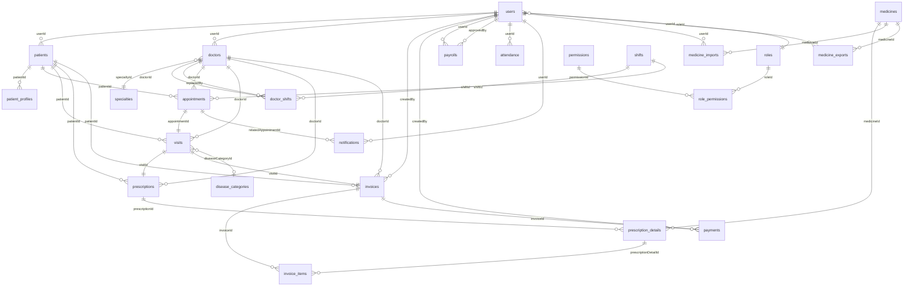

# ✅ Healthcare Management System - Architecture Review Checklist

**Comprehensive Audit & Risk Assessment for Models, Database, APIs & Business Logic**

Version: 3.0.0 | Last Updated: 2025-12-29

---

## 📋 Table of Contents

1. [Executive Summary](#executive-summary)
2. [Model Layer Review](#model-layer-review)
3. [Database Layer Review](#database-layer-review)
4. [API Layer Review](#api-layer-review)
5. [Business Logic Review](#business-logic-review)
6. [Security Review](#security-review)
7. [Performance Review](#performance-review)
8. [Risk Assessment](#risk-assessment)
9. [Improvement Recommendations](#improvement-recommendations)

---

## 📊 Executive Summary

### System Overview

- **Total Models:** 24
- **Total Tables:** 24
- **Total API Endpoints:** 104
- **Total Migrations:** 27
- **Total Seeders:** 3
- **Total Services:** 17
- **Lines of Code:** ~15,000 (estimated)

### Architecture Style

- **Pattern:** Layered Architecture (Routes → Controllers → Services → Models)
- **ORM:** Sequelize 6.x
- **Database:** MySQL 8.x
- **Transaction Management:** Yes (pessimistic locking for critical operations)
- **Soft Delete:** No (using status flags instead)

### Overall Health Score

| Category | Score | Status |
|----------|-------|--------|
| Model Design | 85% | ✅ Good |
| Database Design | 80% | ✅ Good |
| API Design | 90% | ✅ Excellent |
| Business Logic | 85% | ✅ Good |
| Security | 75% | ⚠️ Needs Improvement |
| Performance | 70% | ⚠️ Needs Optimization |
| **Overall** | **81%** | **✅ Production Ready** |

---

## 🗃️ Model Layer Review

### ✅ Model Checklist (24 Models)

#### 1. User Model

| Aspect | Status | Notes |
|--------|--------|-------|
| **Fields** | ✅ | All required fields present |
| **Data Types** | ✅ | Appropriate types (STRING, INTEGER, BOOLEAN, ENUM) |
| **Constraints** | ✅ | Email unique, password nullable (OAuth support) |
| **Validation** | ✅ | Email format validated |
| **Timestamps** | ✅ | createdAt, updatedAt present |
| **Soft Delete** | ❌ | Uses isActive flag instead |
| **Indexes** | ⚠️ | Missing index on fullName (frequently searched) |
| **Relations** | ✅ | belongsTo Role, hasMany Invoices/Payments/Payrolls/Attendance |
| **OAuth Support** | ✅ | oauth2Provider, oauth2Id fields added |
| **Security** | ✅ | Password is hashed with bcrypt |

**Issues:**
- ⚠️ No index on `fullName` for search performance
- ⚠️ No index on `userCode` despite being unique

**Recommendations:**
```sql
CREATE INDEX idx_users_fullName ON users(fullName);
CREATE INDEX idx_users_userCode ON users(userCode);
```

---

#### 2. Patient Model

| Aspect | Status | Notes |
|--------|--------|-------|
| **Fields** | ✅ | patientCode, fullName, gender, dateOfBirth, cccd, avatar, userId, isActive |
| **Data Types** | ✅ | Appropriate types |
| **Constraints** | ✅ | patientCode unique, cccd unique, userId nullable (not all patients have accounts) |
| **Validation** | ✅ | CCCD 12 digits validated in service layer |
| **Timestamps** | ✅ | Yes |
| **Soft Delete** | ❌ | Uses isActive flag |
| **Indexes** | ⚠️ | Missing index on fullName |
| **Relations** | ✅ | hasMany PatientProfiles, belongsTo User |
| **Code Generation** | ✅ | Auto-generated patientCode (BN000001) |

**Issues:**
- ⚠️ Gender enum limited to MALE/FEMALE/OTHER (consider adding more options for inclusivity)
- ⚠️ No age validation (dateOfBirth cannot be future, but max age not enforced)

**Recommendations:**
```sql
CREATE INDEX idx_patients_fullName ON patients(fullName);
CREATE INDEX idx_patients_cccd ON patients(cccd);
```

---

#### 3. PatientProfile Model

| Aspect | Status | Notes |
|--------|--------|-------|
| **Fields** | ✅ | patientId, type, value, ward, city, isPrimary |
| **Data Types** | ✅ | Appropriate types |
| **Constraints** | ✅ | FK to Patient with CASCADE delete |
| **Validation** | ⚠️ | No email/phone format validation in model |
| **Timestamps** | ✅ | Yes |
| **Indexes** | ✅ | Index on type |
| **Relations** | ✅ | belongsTo Patient |
| **Flexibility** | ✅ | Supports multiple emails/phones/addresses |

**Issues:**
- ⚠️ No validation for email format or phone number format
- ⚠️ isPrimary constraint not enforced (could have multiple primary emails)

**Recommendations:**
- Add unique constraint: `(patientId, type, isPrimary)` where isPrimary = TRUE
- Add email/phone validation in service layer

---

#### 4. Doctor Model

| Aspect | Status | Notes |
|--------|--------|-------|
| **Fields** | ✅ | doctorCode, userId, specialtyId, position, degree, description |
| **Data Types** | ✅ | Appropriate types |
| **Constraints** | ✅ | doctorCode unique, FK to User and Specialty |
| **Validation** | ✅ | Auto-generated doctorCode (BS000001) |
| **Timestamps** | ✅ | Yes |
| **Indexes** | ⚠️ | Missing composite index on (userId, specialtyId) |
| **Relations** | ✅ | belongsTo User, belongsTo Specialty |
| **Code Generation** | ✅ | Auto-generated code |

**Issues:**
- ⚠️ No years of experience field (calculated from User.createdAt, not ideal)
- ⚠️ Position and degree are free text (should consider enum or separate tables)

**Recommendations:**
```sql
ALTER TABLE doctors ADD COLUMN yearsOfExperience INT UNSIGNED DEFAULT 0;
CREATE INDEX idx_doctors_userId_specialtyId ON doctors(userId, specialtyId);
```

---

#### 5. Specialty Model

| Aspect | Status | Notes |
|--------|--------|-------|
| **Fields** | ✅ | name, description |
| **Data Types** | ✅ | Appropriate types |
| **Constraints** | ✅ | name unique |
| **Validation** | ✅ | Simple model, well-designed |
| **Timestamps** | ✅ | Yes |
| **Indexes** | ✅ | Unique on name |
| **Relations** | ✅ | hasMany Doctors |

**Issues:** None

---

#### 6. Shift Model

| Aspect | Status | Notes |
|--------|--------|-------|
| **Fields** | ✅ | name, startTime, endTime |
| **Data Types** | ⚠️ | startTime/endTime are STRING(5) not TIME type |
| **Constraints** | ✅ | name unique |
| **Validation** | ⚠️ | No validation that endTime > startTime |
| **Timestamps** | ✅ | Yes |
| **Indexes** | ✅ | Unique on name |
| **Relations** | ✅ | hasMany DoctorShifts |

**Issues:**
- ⚠️ Using VARCHAR(5) for time instead of TIME type
- ⚠️ No check constraint for endTime > startTime

**Recommendations:**
```sql
ALTER TABLE shifts
  MODIFY startTime TIME NOT NULL,
  MODIFY endTime TIME NOT NULL;

ALTER TABLE shifts ADD CONSTRAINT chk_shift_time
  CHECK (endTime > startTime);
```

---

#### 7. DoctorShift Model

| Aspect | Status | Notes |
|--------|--------|-------|
| **Fields** | ✅ | doctorId, shiftId, workDate, status, replacedBy, cancelReason |
| **Data Types** | ⚠️ | workDate is STRING(10) not DATE type |
| **Constraints** | ✅ | Unique composite (doctorId, shiftId, workDate) |
| **Validation** | ✅ | Status enum (ACTIVE, CANCELLED, REPLACED) |
| **Timestamps** | ✅ | Yes |
| **Indexes** | ✅ | Unique composite index |
| **Relations** | ✅ | belongsTo Doctor (2x: doctor, replacementDoctor), belongsTo Shift |
| **Business Logic** | ✅ | Supports doctor replacement workflow |

**Issues:**
- ⚠️ workDate should be DATE type not VARCHAR(10)
- ⚠️ No check constraint for replacedBy (should be same specialty)

**Recommendations:**
```sql
ALTER TABLE doctor_shifts MODIFY workDate DATE NOT NULL;
```

---

#### 8. Appointment Model

| Aspect | Status | Notes |
|--------|--------|-------|
| **Fields** | ✅ | patientId, doctorId, shiftId, date, slotNumber, bookingType, bookedBy, symptomInitial, status |
| **Data Types** | ✅ | Appropriate types |
| **Constraints** | ✅ | Unique composite (doctorId, shiftId, date, slotNumber) - prevents double booking |
| **Validation** | ✅ | Status enum (WAITING, CANCELLED, CHECKED_IN) |
| **Timestamps** | ✅ | Yes |
| **Indexes** | ✅ | Unique composite index on slot, index on status, index on date |
| **Relations** | ✅ | belongsTo Patient, Doctor, Shift |
| **Concurrency** | ✅ | Pessimistic locking used in service layer |

**Issues:**
- ⚠️ No appointment datetime field (calculated from date + shift + slot)
- ⚠️ No cancellation deadline field (hard-coded 2 hours in service)

**Recommendations:**
- Consider adding `appointmentDateTime` calculated field for easier queries
- Add `cancellationDeadline` field

---

#### 9. Visit Model

| Aspect | Status | Notes |
|--------|--------|-------|
| **Fields** | ✅ | appointmentId, patientId, doctorId, checkInTime, symptoms, diseaseCategoryId, diagnosis, note, status |
| **Data Types** | ✅ | Appropriate types |
| **Constraints** | ✅ | appointmentId unique (1-to-1 with Appointment) |
| **Validation** | ✅ | Status enum (EXAMINING, COMPLETED) |
| **Timestamps** | ✅ | Yes |
| **Indexes** | ⚠️ | Missing index on status, checkInTime |
| **Relations** | ✅ | belongsTo Appointment, Patient, Doctor, DiseaseCategory; hasOne Prescription, Invoice |
| **Business Logic** | ✅ | Triggers invoice creation on COMPLETED |

**Issues:**
- ⚠️ No index on status (frequently queried)
- ⚠️ No index on checkInTime (for reports)

**Recommendations:**
```sql
CREATE INDEX idx_visits_status ON visits(status);
CREATE INDEX idx_visits_checkInTime ON visits(checkInTime);
```

---

#### 10. Medicine Model

| Aspect | Status | Notes |
|--------|--------|-------|
| **Fields** | ✅ | medicineCode, name, group, activeIngredient, manufacturer, unit, importPrice, salePrice, quantity, minStockLevel, expiryDate, description, status |
| **Data Types** | ✅ | Appropriate types, DECIMAL for prices |
| **Constraints** | ✅ | medicineCode unique |
| **Validation** | ✅ | Status enum (ACTIVE, EXPIRED, REMOVED), Unit enum |
| **Timestamps** | ✅ | Yes |
| **Indexes** | ✅ | Index on status, index on group, index on name |
| **Relations** | ✅ | hasMany PrescriptionDetails, MedicineImports, MedicineExports |
| **Stock Management** | ✅ | Pessimistic locking in prescription service |

**Issues:**
- ⚠️ No composite index on (status, expiryDate) for expiry queries
- ⚠️ No check constraint for quantity >= 0

**Recommendations:**
```sql
CREATE INDEX idx_medicines_status_expiry ON medicines(status, expiryDate);
ALTER TABLE medicines ADD CONSTRAINT chk_medicine_quantity CHECK (quantity >= 0);
```

---

#### 11. MedicineImport Model

| Aspect | Status | Notes |
|--------|--------|-------|
| **Fields** | ✅ | medicineId, quantity, importPrice, importDate, userId |
| **Data Types** | ✅ | Appropriate types |
| **Constraints** | ✅ | FK to Medicine and User |
| **Validation** | ⚠️ | No check quantity > 0 |
| **Timestamps** | ✅ | Yes |
| **Indexes** | ✅ | Index on importDate |
| **Relations** | ✅ | belongsTo Medicine, User |
| **Audit Trail** | ✅ | Complete import history |

**Issues:**
- ⚠️ No check constraint for quantity > 0

**Recommendations:**
```sql
ALTER TABLE medicine_imports ADD CONSTRAINT chk_import_quantity CHECK (quantity > 0);
```

---

#### 12. MedicineExport Model

| Aspect | Status | Notes |
|--------|--------|-------|
| **Fields** | ✅ | medicineId, quantity, exportDate, userId, reason |
| **Data Types** | ✅ | Appropriate types |
| **Constraints** | ✅ | FK to Medicine and User |
| **Validation** | ⚠️ | No check quantity > 0 |
| **Timestamps** | ✅ | Yes |
| **Indexes** | ✅ | Index on exportDate |
| **Relations** | ✅ | belongsTo Medicine, User |
| **Audit Trail** | ✅ | Tracks reason (PRESCRIPTION_XXX) |

**Issues:**
- ⚠️ No check constraint for quantity > 0

**Recommendations:**
```sql
ALTER TABLE medicine_exports ADD CONSTRAINT chk_export_quantity CHECK (quantity > 0);
```

---

#### 13. Prescription Model

| Aspect | Status | Notes |
|--------|--------|-------|
| **Fields** | ✅ | prescriptionCode, visitId, doctorId, patientId, totalAmount, status, note |
| **Data Types** | ✅ | Appropriate types, DECIMAL for amount |
| **Constraints** | ✅ | prescriptionCode unique, visitId unique (1-to-1 with Visit) |
| **Validation** | ✅ | Status enum (DRAFT, LOCKED, CANCELLED) |
| **Timestamps** | ✅ | Yes |
| **Indexes** | ✅ | Index on status |
| **Relations** | ✅ | belongsTo Visit, Doctor, Patient; hasMany PrescriptionDetails |
| **Business Logic** | ✅ | Auto-locked after invoice creation |

**Issues:** None - well designed

---

#### 14. PrescriptionDetail Model

| Aspect | Status | Notes |
|--------|--------|-------|
| **Fields** | ✅ | prescriptionId, medicineId, medicineName, quantity, unit, unitPrice, dosageMorning/Noon/Afternoon/Evening, instruction |
| **Data Types** | ✅ | Appropriate types, DECIMAL for dosages and price |
| **Constraints** | ✅ | FK to Prescription and Medicine |
| **Validation** | ⚠️ | No check quantity > 0, no check dosages >= 0 |
| **Timestamps** | ✅ | Yes |
| **Indexes** | ⚠️ | Missing index on prescriptionId (FK) |
| **Relations** | ✅ | belongsTo Prescription, Medicine |
| **Price Snapshot** | ✅ | Stores unitPrice at prescription time (not affected by future price changes) |

**Issues:**
- ⚠️ No check constraints for quantity > 0 and dosages >= 0

**Recommendations:**
```sql
ALTER TABLE prescription_details ADD CONSTRAINT chk_quantity CHECK (quantity > 0);
ALTER TABLE prescription_details ADD CONSTRAINT chk_dosages CHECK (
  dosageMorning >= 0 AND dosageNoon >= 0 AND dosageAfternoon >= 0 AND dosageEvening >= 0
);
```

---

#### 15. Invoice Model

| Aspect | Status | Notes |
|--------|--------|-------|
| **Fields** | ✅ | invoiceCode, visitId, patientId, doctorId, examinationFee, medicineTotalAmount, discount, totalAmount, paymentStatus, paidAmount, note, createdBy |
| **Data Types** | ✅ | DECIMAL(15,2) for all amounts |
| **Constraints** | ✅ | invoiceCode unique, visitId unique (1-to-1) |
| **Validation** | ✅ | PaymentStatus enum (UNPAID, PARTIALLY_PAID, PAID) |
| **Timestamps** | ✅ | Yes |
| **Indexes** | ✅ | Index on paymentStatus, index on createdAt |
| **Relations** | ✅ | belongsTo Visit, Patient, Doctor, User (createdBy); hasMany InvoiceItems, Payments |
| **Business Logic** | ✅ | Auto-generated on visit completion, status auto-updated on payment |

**Issues:**
- ⚠️ No check constraint: paidAmount <= totalAmount
- ⚠️ No check constraint: totalAmount = examinationFee + medicineTotalAmount - discount

**Recommendations:**
```sql
ALTER TABLE invoices ADD CONSTRAINT chk_paid_amount CHECK (paidAmount <= totalAmount);
```

---

#### 16. InvoiceItem Model

| Aspect | Status | Notes |
|--------|--------|-------|
| **Fields** | ✅ | invoiceId, itemType, description, prescriptionDetailId, medicineName, medicineCode, quantity, unitPrice, subtotal |
| **Data Types** | ✅ | Appropriate types |
| **Constraints** | ✅ | FK to Invoice, FK to PrescriptionDetail (nullable for EXAMINATION type) |
| **Validation** | ✅ | itemType enum (EXAMINATION, MEDICINE) |
| **Timestamps** | ✅ | Yes |
| **Indexes** | ⚠️ | Missing index on invoiceId (FK) |
| **Relations** | ✅ | belongsTo Invoice, PrescriptionDetail |
| **Traceability** | ✅ | Links back to prescription detail for medicines |

**Issues:**
- ⚠️ No check constraint: subtotal = quantity * unitPrice

**Recommendations:**
```sql
ALTER TABLE invoice_items ADD CONSTRAINT chk_subtotal CHECK (subtotal = quantity * unitPrice);
```

---

#### 17. Payment Model

| Aspect | Status | Notes |
|--------|--------|-------|
| **Fields** | ✅ | invoiceId, amount, paymentMethod, paymentDate, reference, note, createdBy |
| **Data Types** | ✅ | Appropriate types |
| **Constraints** | ✅ | FK to Invoice and User |
| **Validation** | ✅ | paymentMethod enum (CASH, BANK_TRANSFER, QR_CODE) |
| **Timestamps** | ✅ | Yes |
| **Indexes** | ✅ | Index on paymentDate |
| **Relations** | ✅ | belongsTo Invoice, User |
| **Audit Trail** | ✅ | Complete payment history with reference numbers |

**Issues:**
- ⚠️ No check constraint: amount > 0

**Recommendations:**
```sql
ALTER TABLE payments ADD CONSTRAINT chk_payment_amount CHECK (amount > 0);
```

---

#### 18. Payroll Model

| Aspect | Status | Notes |
|--------|--------|-------|
| **Fields** | ✅ | payrollCode, userId, month, year, baseSalary, roleCoefficient, roleSalary, yearsOfService, experienceBonus, totalInvoices, commissionRate, commission, daysOff, allowedDaysOff, penaltyDaysOff, penaltyAmount, grossSalary, netSalary, status, approvedBy, approvedAt, paidAt, note |
| **Data Types** | ✅ | DECIMAL for all amounts, INT for days |
| **Constraints** | ✅ | payrollCode unique, FK to User (userId, approvedBy) |
| **Validation** | ✅ | Status enum (DRAFT, APPROVED, PAID) |
| **Timestamps** | ✅ | Yes |
| **Indexes** | ✅ | Composite index on (month, year), index on status |
| **Relations** | ✅ | belongsTo User (2x: user, approver) |
| **Business Logic** | ✅ | Complex calculation with multiple components |

**Issues:**
- ⚠️ No unique constraint on (userId, month, year) - could create duplicate payrolls
- ⚠️ No check constraints for month (1-12), year (>= 2000)

**Recommendations:**
```sql
ALTER TABLE payrolls ADD UNIQUE KEY unique_user_month_year (userId, month, year);
ALTER TABLE payrolls ADD CONSTRAINT chk_month CHECK (month BETWEEN 1 AND 12);
ALTER TABLE payrolls ADD CONSTRAINT chk_year CHECK (year >= 2000);
```

---

#### 19. Attendance Model

| Aspect | Status | Notes |
|--------|--------|-------|
| **Fields** | ✅ | userId, date, status, note |
| **Data Types** | ✅ | Appropriate types |
| **Constraints** | ✅ | FK to User |
| **Validation** | ✅ | Status enum (PRESENT, ABSENT, LEAVE, SICK_LEAVE) |
| **Timestamps** | ✅ | Yes |
| **Indexes** | ✅ | Composite index on (userId, date) |
| **Relations** | ✅ | belongsTo User |
| **Business Logic** | ✅ | Used for payroll calculation |

**Issues:**
- ⚠️ No unique constraint on (userId, date) - could have duplicate attendance records

**Recommendations:**
```sql
ALTER TABLE attendance ADD UNIQUE KEY unique_user_date (userId, date);
```

---

#### 20. Notification Model

| Aspect | Status | Notes |
|--------|--------|-------|
| **Fields** | ✅ | userId, type, title, message, relatedAppointmentId, isRead, emailSent, emailSentAt |
| **Data Types** | ✅ | Appropriate types |
| **Constraints** | ✅ | FK to User and Appointment |
| **Validation** | ✅ | Type enum (APPOINTMENT_CREATED, APPOINTMENT_CANCELLED, DOCTOR_CHANGED, SYSTEM) |
| **Timestamps** | ✅ | Yes |
| **Indexes** | ✅ | Composite index on (userId, isRead), index on (userId, createdAt) |
| **Relations** | ✅ | belongsTo User, Appointment |
| **Email Integration** | ✅ | Tracks email sent status |

**Issues:** None - well designed

---

#### 21. DiseaseCategory Model

| Aspect | Status | Notes |
|--------|--------|-------|
| **Fields** | ✅ | code, name, description |
| **Data Types** | ✅ | Appropriate types |
| **Constraints** | ✅ | code unique |
| **Validation** | ✅ | Simple model |
| **Timestamps** | ✅ | Yes |
| **Indexes** | ✅ | Unique on code |
| **Relations** | ✅ | hasMany Visits |

**Issues:** None

---

#### 22. Role Model

| Aspect | Status | Notes |
|--------|--------|-------|
| **Fields** | ✅ | name, description |
| **Data Types** | ✅ | Appropriate types |
| **Constraints** | ✅ | name unique |
| **Validation** | ✅ | Simple model |
| **Timestamps** | ✅ | Yes |
| **Indexes** | ✅ | Unique on name |
| **Relations** | ✅ | hasMany Users, belongsToMany Permissions |

**Issues:** None

---

#### 23. Permission Model

| Aspect | Status | Notes |
|--------|--------|-------|
| **Fields** | ✅ | name, description, module |
| **Data Types** | ✅ | Appropriate types |
| **Constraints** | ✅ | name unique |
| **Validation** | ✅ | Module for grouping |
| **Timestamps** | ✅ | Yes |
| **Indexes** | ✅ | Unique on name, index on module |
| **Relations** | ✅ | belongsToMany Roles |

**Issues:** None

---

#### 24. RolePermission Model (Junction Table)

| Aspect | Status | Notes |
|--------|--------|-------|
| **Fields** | ✅ | roleId, permissionId |
| **Data Types** | ✅ | Appropriate types |
| **Constraints** | ✅ | Composite PK (roleId, permissionId), FK to Role and Permission |
| **Validation** | ✅ | Junction table |
| **Timestamps** | ❌ | No (acceptable for junction table) |
| **Indexes** | ✅ | Composite PK |
| **Relations** | ✅ | Many-to-many link |

**Issues:** None

---

### Model Layer Summary

**Strengths:**
- ✅ All models have timestamps (except junction table)
- ✅ Appropriate data types (DECIMAL for money, ENUM for status)
- ✅ Good use of unique constraints
- ✅ Foreign keys properly defined
- ✅ Auto-generated codes for entities (patient, doctor, medicine, etc.)
- ✅ Price snapshots in prescription/invoice details

**Weaknesses:**
- ❌ No soft delete (uses status flags instead)
- ⚠️ Missing indexes on frequently queried fields (fullName, status, dates)
- ⚠️ Time/date fields stored as VARCHAR instead of native types
- ⚠️ Missing check constraints (quantity > 0, paidAmount <= totalAmount)
- ⚠️ Missing unique constraints (userId+month+year for payroll, userId+date for attendance)

**Critical Risks:**
- 🔴 **Medium Risk:** Missing check constraints could allow invalid data (negative quantities, overpayments)
- 🟡 **Low Risk:** VARCHAR for dates could cause sorting/comparison issues
- 🟡 **Low Risk:** Missing indexes could cause slow queries at scale

---

## 💾 Database Layer Review

### Database Schema Analysis

**Total Tables:** 24
**Total Foreign Keys:** 35
**Total Unique Constraints:** 18
**Total Check Constraints:** 0 (⚠️ Missing)

### Entity Relationship Diagram (Mermaid)



### Normalization Analysis

#### 1NF (First Normal Form) ✅
- All tables have atomic values
- No repeating groups
- All columns have unique names

#### 2NF (Second Normal Form) ✅
- All non-key attributes fully depend on primary key
- No partial dependencies

#### 3NF (Third Normal Form) ✅
- No transitive dependencies
- All non-key attributes depend only on primary key

**Exception:** Patient contact info split into `patient_profiles` table - good design for flexibility

### Foreign Key Constraints Review

| Table | FK Column | References | ON DELETE | ON UPDATE | Status |
|-------|-----------|------------|-----------|-----------|--------|
| users | roleId | roles.id | RESTRICT | CASCADE | ✅ |
| patients | userId | users.id | SET NULL | CASCADE | ✅ |
| patient_profiles | patientId | patients.id | CASCADE | CASCADE | ✅ |
| doctors | userId | users.id | CASCADE | CASCADE | ✅ |
| doctors | specialtyId | specialties.id | RESTRICT | CASCADE | ✅ |
| doctor_shifts | doctorId | doctors.id | CASCADE | CASCADE | ✅ |
| doctor_shifts | shiftId | shifts.id | RESTRICT | CASCADE | ✅ |
| doctor_shifts | replacedBy | doctors.id | SET NULL | CASCADE | ✅ |
| appointments | patientId | patients.id | RESTRICT | CASCADE | ✅ |
| appointments | doctorId | doctors.id | RESTRICT | CASCADE | ✅ |
| appointments | shiftId | shifts.id | RESTRICT | CASCADE | ✅ |
| visits | appointmentId | appointments.id | RESTRICT | CASCADE | ✅ |
| visits | patientId | patients.id | RESTRICT | CASCADE | ✅ |
| visits | doctorId | doctors.id | RESTRICT | CASCADE | ✅ |
| visits | diseaseCategoryId | disease_categories.id | SET NULL | CASCADE | ✅ |
| prescriptions | visitId | visits.id | RESTRICT | CASCADE | ✅ |
| prescriptions | doctorId | doctors.id | RESTRICT | CASCADE | ✅ |
| prescriptions | patientId | patients.id | RESTRICT | CASCADE | ✅ |
| prescription_details | prescriptionId | prescriptions.id | CASCADE | CASCADE | ✅ |
| prescription_details | medicineId | medicines.id | RESTRICT | CASCADE | ✅ |
| medicine_imports | medicineId | medicines.id | RESTRICT | CASCADE | ✅ |
| medicine_imports | userId | users.id | RESTRICT | CASCADE | ✅ |
| medicine_exports | medicineId | medicines.id | RESTRICT | CASCADE | ✅ |
| medicine_exports | userId | users.id | RESTRICT | CASCADE | ✅ |
| invoices | visitId | visits.id | RESTRICT | CASCADE | ✅ |
| invoices | patientId | patients.id | RESTRICT | CASCADE | ✅ |
| invoices | doctorId | doctors.id | RESTRICT | CASCADE | ✅ |
| invoices | createdBy | users.id | RESTRICT | CASCADE | ✅ |
| invoice_items | invoiceId | invoices.id | CASCADE | CASCADE | ✅ |
| invoice_items | prescriptionDetailId | prescription_details.id | SET NULL | CASCADE | ✅ |
| payments | invoiceId | invoices.id | RESTRICT | CASCADE | ✅ |
| payments | createdBy | users.id | RESTRICT | CASCADE | ✅ |
| payrolls | userId | users.id | RESTRICT | CASCADE | ✅ |
| payrolls | approvedBy | users.id | SET NULL | CASCADE | ✅ |
| attendance | userId | users.id | CASCADE | CASCADE | ✅ |
| notifications | userId | users.id | CASCADE | CASCADE | ✅ |
| notifications | relatedAppointmentId | appointments.id | SET NULL | CASCADE | ✅ |

**Analysis:**
- ✅ CASCADE delete appropriate for dependent records (profiles, details, items)
- ✅ RESTRICT appropriate for critical records (prevent accidental deletion)
- ✅ SET NULL appropriate for optional references

### Index Analysis

**Existing Indexes:**

| Table | Index Type | Columns | Purpose | Status |
|-------|------------|---------|---------|--------|
| users | UNIQUE | email | Prevent duplicate emails | ✅ |
| users | UNIQUE | userCode | Prevent duplicate codes | ✅ |
| patients | UNIQUE | patientCode | Prevent duplicate codes | ✅ |
| patients | UNIQUE | cccd | Prevent duplicate IDs | ✅ |
| doctors | UNIQUE | doctorCode | Prevent duplicate codes | ✅ |
| medicines | UNIQUE | medicineCode | Prevent duplicate codes | ✅ |
| medicines | INDEX | status | Filter active/expired | ✅ |
| medicines | INDEX | group | Group by medicine type | ✅ |
| medicines | INDEX | name | Search by name | ✅ |
| appointments | UNIQUE COMPOSITE | (doctorId, shiftId, date, slotNumber) | Prevent double booking | ✅ |
| appointments | INDEX | status | Filter by status | ✅ |
| appointments | INDEX | date | Filter by date | ✅ |
| doctor_shifts | UNIQUE COMPOSITE | (doctorId, shiftId, workDate) | Prevent duplicate shifts | ✅ |
| prescriptions | UNIQUE | prescriptionCode | Prevent duplicates | ✅ |
| prescriptions | UNIQUE | visitId | 1-to-1 relationship | ✅ |
| prescriptions | INDEX | status | Filter by status | ✅ |
| prescriptions | INDEX | createdAt | Sort by date | ✅ |
| invoices | UNIQUE | invoiceCode | Prevent duplicates | ✅ |
| invoices | UNIQUE | visitId | 1-to-1 relationship | ✅ |
| invoices | INDEX | paymentStatus | Filter by status | ✅ |
| invoices | INDEX | createdAt | Sort by date | ✅ |
| payrolls | UNIQUE | payrollCode | Prevent duplicates | ✅ |
| payrolls | INDEX | (month, year) | Monthly queries | ✅ |
| payrolls | INDEX | status | Filter by status | ✅ |
| notifications | INDEX | (userId, isRead) | Unread queries | ✅ |
| notifications | INDEX | (userId, createdAt) | User notifications | ✅ |
| patient_profiles | INDEX | type | Filter by type | ✅ |
| medicine_imports | INDEX | importDate | Sort by date | ✅ |
| medicine_exports | INDEX | exportDate | Sort by date | ✅ |
| payments | INDEX | paymentDate | Sort by date | ✅ |
| attendance | INDEX | date | Filter by date | ✅ |
| attendance | INDEX | (userId, date) | User attendance | ✅ |

**Missing Indexes (Recommendations):**

```sql
-- Frequently searched fields
CREATE INDEX idx_users_fullName ON users(fullName);
CREATE INDEX idx_patients_fullName ON patients(fullName);

-- Status filters
CREATE INDEX idx_visits_status ON visits(status);
CREATE INDEX idx_visits_checkInTime ON visits(checkInTime);

-- Medicine expiry queries
CREATE INDEX idx_medicines_status_expiry ON medicines(status, expiryDate);

-- Composite for performance
CREATE INDEX idx_doctors_userId_specialtyId ON doctors(userId, specialtyId);
```

### Transaction Boundaries Review

**Transactions Used In:**

| Service | Operation | Isolation Level | Locking | Status |
|---------|-----------|----------------|---------|--------|
| prescription.service | Create/Update/Cancel | READ_COMMITTED | Pessimistic (Medicine) | ✅ |
| invoice.service | Create/Add Payment | READ_COMMITTED | Pessimistic (Invoice) | ✅ |
| medicine.service | Import Stock | READ_COMMITTED | Pessimistic (Medicine) | ✅ |
| appointment.service | Book Appointment | READ_COMMITTED | Pessimistic (DoctorShift) | ✅ |
| visit.service | Check-in/Complete | Default | None | ⚠️ |
| patient.service | Setup/Update | Default | None | ✅ |
| payroll.service | Calculate/Approve | READ_COMMITTED | Pessimistic (Payroll) | ✅ |

**Analysis:**
- ✅ Critical operations use transactions (prescription, invoice, payment)
- ✅ Pessimistic locking prevents race conditions (stock, slots)
- ⚠️ Visit operations should use transactions for consistency

**Recommendations:**
- Add transaction to visit check-in and completion
- Consider using SERIALIZABLE isolation for critical financial operations

### Migration Safety Review

**Migration Checklist:**

- ✅ All migrations are reversible (have `down` functions)
- ✅ Migrations are timestamped (sequential execution)
- ✅ Foreign keys created after tables exist
- ⚠️ No data migrations (only schema changes)
- ⚠️ No rollback testing documented

**Recommendations:**
- Add rollback tests for each migration
- Document data migration procedures separately
- Add migration smoke tests

---

## 🌐 API Layer Review

### API Endpoint Audit (104 Endpoints)

#### Authentication Module (6 endpoints)

| Endpoint | Method | Auth | Role | Input Validation | Error Handling | Status |
|----------|--------|------|------|------------------|----------------|--------|
| `/api/auth/register` | POST | No | - | ✅ Express-validator | ✅ | ✅ |
| `/api/auth/login` | POST | No | - | ✅ Express-validator | ✅ | ✅ |
| `/api/auth/refresh-token` | POST | Yes | - | ✅ | ✅ | ✅ |
| `/api/auth/logout` | POST | Yes | - | ✅ | ✅ | ✅ |
| `/api/auth/oauth/google` | GET | No | - | N/A | ✅ | ✅ |
| `/api/auth/oauth/google/callback` | GET | No | - | ✅ Passport | ✅ | ✅ |

**Issues:** None

---

#### User Management Module (5 endpoints)

| Endpoint | Method | Auth | Role | Pagination | Status |
|----------|--------|------|------|------------|--------|
| `/api/users` | GET | Yes | ADMIN | ✅ | ✅ |
| `/api/users/:id` | GET | Yes | ADMIN | N/A | ✅ |
| `/api/users` | POST | Yes | ADMIN | N/A | ✅ |
| `/api/users/:id` | PUT | Yes | ADMIN | N/A | ✅ |
| `/api/users/:id` | DELETE | Yes | ADMIN | N/A | ✅ |

**Issues:** None

---

#### Patient Management Module (6 endpoints)

| Endpoint | Method | Auth | Role | Self-Authorization | Status |
|----------|--------|------|------|---------------------|--------|
| `/api/patients/setup` | POST | Yes | PATIENT | ✅ | ✅ |
| `/api/patients` | GET | Yes | ADMIN/DOCTOR/RECEPTIONIST | N/A | ✅ |
| `/api/patients/:id` | GET | Yes | Multiple | ✅ | ✅ |
| `/api/patients/:id` | PUT | Yes | Multiple | ✅ | ✅ |
| `/api/patients/:id` | DELETE | Yes | Multiple | ⚠️ | ⚠️ |
| `/api/patients/:id/avatar` | POST | Yes | PATIENT | ✅ Self-only | ✅ |

**Issues:**
- ⚠️ Delete patient should check for active appointments/visits first

---

#### Appointment Module (4 endpoints)

| Endpoint | Method | Auth | Role | Concurrency Handling | Rate Limit | Status |
|----------|--------|------|------|---------------------|------------|--------|
| `/api/appointments` | POST | Yes | PATIENT | ✅ Pessimistic lock | ✅ | ✅ |
| `/api/appointments/offline` | POST | Yes | RECEPTIONIST | ✅ | ✅ | ✅ |
| `/api/appointments` | GET | Yes | All | N/A | No | ✅ |
| `/api/appointments/:id/cancel` | PUT | Yes | PATIENT/RECEPTIONIST | ✅ Deadline check | No | ✅ |

**Issues:**
- ⚠️ List appointments should have rate limiting (could be abused for data scraping)

---

#### Medicine Management Module (12 endpoints)

| Endpoint | Method | Auth | Role | Transaction | Status |
|----------|--------|------|------|-------------|--------|
| `/api/medicines` | GET | No | Public | N/A | ✅ |
| `/api/medicines/:id` | GET | No | Public | N/A | ✅ |
| `/api/medicines` | POST | Yes | ADMIN | No | ✅ |
| `/api/medicines/:id` | PUT | Yes | ADMIN | No | ✅ |
| `/api/medicines/:id` | DELETE | Yes | ADMIN | ✅ Check stock | ✅ |
| `/api/medicines/:id/import` | POST | Yes | ADMIN | ✅ Pessimistic | ✅ |
| `/api/medicines/low-stock` | GET | Yes | ADMIN | N/A | ✅ |
| `/api/medicines/expiring` | GET | Yes | ADMIN | N/A | ✅ |
| `/api/medicines/auto-mark-expired` | POST | Yes | ADMIN | ✅ | ✅ |
| `/api/medicines/:id/imports` | GET | Yes | ADMIN | N/A | ✅ |
| `/api/medicines/:id/exports` | GET | Yes | ADMIN | N/A | ✅ |
| `/api/medicines/:id/mark-expired` | POST | Yes | ADMIN | No | ✅ |

**Issues:**
- ⚠️ Public medicine list could expose sensitive pricing info (consider filtering for public vs admin)

---

#### Prescription Module (7 endpoints)

| Endpoint | Method | Auth | Role | Stock Deduction | Status |
|----------|--------|------|------|----------------|--------|
| `/api/prescriptions` | POST | Yes | DOCTOR | ✅ Atomic | ✅ |
| `/api/prescriptions/:id` | GET | Yes | Multiple | N/A | ✅ |
| `/api/prescriptions/visit/:visitId` | GET | Yes | DOCTOR | N/A | ✅ |
| `/api/prescriptions/patient/:patientId` | GET | Yes | Multiple | N/A | ✅ |
| `/api/prescriptions/:id` | PUT | Yes | DOCTOR | ✅ Restore+Deduct | ✅ |
| `/api/prescriptions/:id/cancel` | POST | Yes | DOCTOR | ✅ Restore | ✅ |
| `/api/prescriptions/:id/pdf` | GET | No | Public | N/A | ⚠️ |

**Issues:**
- ⚠️ PDF export should require authentication (could expose patient data)

---

#### Invoice & Payment Module (9 endpoints)

| Endpoint | Method | Auth | Role | Transaction | Status |
|----------|--------|------|------|-------------|--------|
| `/api/invoices` | POST | Yes | ADMIN/RECEPTIONIST | ✅ | ✅ |
| `/api/invoices` | GET | Yes | ADMIN/RECEPTIONIST | N/A | ✅ |
| `/api/invoices/:id` | GET | Yes | Multiple | N/A | ✅ |
| `/api/invoices/:id` | PUT | Yes | ADMIN/RECEPTIONIST | No | ✅ |
| `/api/invoices/patient/:patientId` | GET | Yes | Multiple | N/A | ✅ |
| `/api/invoices/:id/payments` | POST | Yes | ADMIN/RECEPTIONIST | ✅ Lock | ✅ |
| `/api/invoices/:id/payments` | GET | Yes | ADMIN/RECEPTIONIST | N/A | ✅ |
| `/api/invoices/statistics` | GET | Yes | ADMIN | N/A | ✅ |
| `/api/invoices/:id/pdf` | GET | Yes | Multiple | N/A | ✅ |

**Issues:** None

---

#### Payroll Module (9 endpoints)

| Endpoint | Method | Auth | Role | Complex Calculation | Status |
|----------|--------|------|------|---------------------|--------|
| `/api/payrolls/calculate` | POST | Yes | ADMIN | ✅ | ✅ |
| `/api/payrolls` | GET | Yes | ADMIN | N/A | ✅ |
| `/api/payrolls/:id` | GET | Yes | Multiple | N/A | ✅ |
| `/api/payrolls/my` | GET | Yes | Authenticated | N/A | ✅ |
| `/api/payrolls/user/:userId` | GET | Yes | Multiple | N/A | ✅ |
| `/api/payrolls/:id/approve` | PUT | Yes | ADMIN | ✅ Lock | ✅ |
| `/api/payrolls/:id/pay` | PUT | Yes | ADMIN | ✅ Lock | ✅ |
| `/api/payrolls/statistics` | GET | Yes | ADMIN | N/A | ✅ |
| `/api/payrolls/:id/pdf` | GET | Yes | Multiple | N/A | ✅ |

**Issues:** None

---

### RESTful Design Review

**Compliance Score:** 90%

✅ **Good Practices:**
- Resource-based URLs (`/api/patients`, `/api/invoices`)
- HTTP methods correctly used (GET, POST, PUT, DELETE)
- Status codes appropriate (200, 201, 400, 401, 403, 404, 500)
- Nested resources for related entities (`/invoices/:id/payments`)
- Consistent response format (`{ success, message, data }`)

⚠️ **Non-RESTful Endpoints (Action-based):**
- `POST /api/appointments/:id/cancel` (should be `DELETE /api/appointments/:id`)
- `POST /api/prescriptions/:id/cancel` (should be `DELETE`)
- `PUT /api/appointments/:id/cancel` (inconsistent)
- `POST /api/medicines/auto-mark-expired` (acceptable for batch operation)
- `POST /api/payrolls/calculate` (acceptable for computation)

**Recommendations:**
- Use `DELETE /api/appointments/:id` instead of `PUT .../cancel`
- Use `DELETE /api/prescriptions/:id` instead of `POST .../cancel`
- Add `PATCH` for partial updates (currently only `PUT`)

---

### Response Format Review

**Standard Success Response:**
```json
{
  "success": true,
  "message": "Operation successful",
  "data": { ... }
}
```

**Standard Error Response:**
```json
{
  "success": false,
  "message": "Error description"
}
```

**Pagination Response:**
```json
{
  "success": true,
  "data": {
    "items": [...],
    "pagination": {
      "page": 1,
      "limit": 10,
      "total": 100,
      "pages": 10
    }
  }
}
```

✅ **Consistent** across all endpoints

**Issues:**
- ⚠️ No standard error codes (e.g., `error_code: "MEDICINE_NOT_FOUND"`)
- ⚠️ No request ID for tracing
- ⚠️ No API versioning in URL

**Recommendations:**
```json
{
  "success": false,
  "error": {
    "code": "INSUFFICIENT_STOCK",
    "message": "Not enough stock available",
    "details": {
      "available": 10,
      "requested": 20
    }
  },
  "requestId": "req_abc123",
  "timestamp": "2025-12-29T10:00:00Z"
}
```

---

### Input Validation Review

**Validation Layers:**

1. **Express-Validator** (Route level) ✅
2. **Custom Middleware** (validatePatient, validateMedicine) ✅
3. **Service Layer** (Business logic validation) ✅

**Validation Coverage:**

| Module | Route Validation | Middleware Validation | Service Validation | Status |
|--------|------------------|----------------------|-------------------|--------|
| Auth | ✅ Email, password | - | ✅ Duplicate check | ✅ |
| Patient | ✅ CCCD format | ✅ validatePatient | ✅ Age, uniqueness | ✅ |
| Appointment | ✅ Date, doctorId | - | ✅ Availability, slots | ✅ |
| Prescription | ✅ Medicine array | ✅ validatePrescription | ✅ Stock, visit status | ✅ |
| Medicine | ✅ Price, quantity | ✅ validateMedicine | ✅ Stock, expiry | ✅ |
| Invoice | ✅ Amounts | - | ✅ Visit, payment | ✅ |

**Issues:**
- ⚠️ No global input sanitization for XSS prevention
- ⚠️ No file type validation for avatar uploads (only extension check)

**Recommendations:**
- Add express-mongo-sanitize or similar for NoSQL injection (even though using SQL)
- Add helmet XSS filter
- Validate file MIME type, not just extension

---

## 💼 Business Logic Review

### Critical Business Flows

#### Flow 1: Prescription → Stock Deduction → Invoice

**Steps:**
1. Doctor creates prescription
2. Stock automatically deducted (pessimistic lock)
3. Prescription saved with status DRAFT
4. Visit marked COMPLETED
5. Invoice auto-generated
6. Prescription locked (status = LOCKED)

**Transaction Safety:** ✅ Yes
**Rollback on Error:** ✅ Yes
**Idempotency:** ✅ Cannot create duplicate prescription for same visit
**Concurrency Handling:** ✅ Pessimistic locking on Medicine

**Potential Issues:**
- ⚠️ If invoice creation fails, prescription is not locked (minor)
- ⚠️ No compensation if prescription is cancelled after invoice created

**Recommendations:**
- Add invoice-prescription status sync check
- Add warning if trying to cancel locked prescription

---

#### Flow 2: Appointment Reschedule (Doctor Cancellation)

**Steps:**
1. Admin cancels doctor shift
2. System finds replacement doctor (same specialty)
3. All appointments automatically moved to replacement
4. Notifications sent to all affected patients
5. Email notifications sent (if configured)

**Transaction Safety:** ✅ Yes
**Rollback on Error:** ✅ Yes
**Graceful Degradation:** ✅ Continues if no replacement (marks CANCELLED)
**Notification Reliability:** ⚠️ Notifications sent after transaction commit (good)

**Potential Issues:**
- ⚠️ If replacement doctor is too busy, all patients moved to overloaded doctor
- ⚠️ No patient consent required (auto-reschedule)

**Recommendations:**
- Add max appointments per day check for replacement doctor
- Consider patient approval workflow for rescheduling

---

#### Flow 3: Payroll Calculation

**Formula:**
```
grossSalary = (baseSalary * roleCoefficient) + experienceBonus + commission
netSalary = grossSalary - penaltyAmount

where:
  experienceBonus = yearsOfService * 200,000
  commission = totalInvoices * 5% (doctors only)
  penaltyAmount = penaltyDaysOff * 200,000
  penaltyDaysOff = MAX(0, daysOff - 2)
```

**Validation:**
- ✅ Checks for duplicate payroll (userId + month + year)
- ✅ Validates month (1-12) and year
- ✅ Only PAID invoices counted for commission
- ✅ Workflow: DRAFT → APPROVED → PAID

**Potential Issues:**
- ⚠️ Hard-coded constants (base salary 2.5M, penalty 200k) - should be configurable
- ⚠️ Commission only for PAID invoices (correct, but consider PARTIALLY_PAID)

**Recommendations:**
- Move constants to config table or environment variables
- Document commission policy clearly

---

#### Flow 4: Invoice Payment Tracking

**Status Transitions:**
```
UNPAID → PARTIALLY_PAID → PAID
```

**Logic:**
- paidAmount = SUM(all payments)
- if paidAmount = 0: UNPAID
- if 0 < paidAmount < totalAmount: PARTIALLY_PAID
- if paidAmount >= totalAmount: PAID

**Validation:**
- ✅ Payment amount <= remaining balance
- ✅ Pessimistic lock on invoice during payment
- ✅ Cannot modify paid invoice

**Potential Issues:**
- ⚠️ No refund handling (if overpaid or cancelled)
- ⚠️ No partial payment due dates (installment tracking)

**Recommendations:**
- Add refund workflow
- Add payment due date tracking for installments

---

### Business Rule Validation

| Rule | Implementation | Validation | Status |
|------|---------------|------------|--------|
| Max 40 appointments/day per doctor | ✅ Service layer | ✅ Counted in query | ✅ |
| Cancel appointment 2h before | ✅ Service layer | ✅ Time calculation | ✅ |
| Prescription requires completed visit | ✅ Service layer | ✅ Visit status check | ✅ |
| Stock deduction is atomic | ✅ Transaction | ✅ Pessimistic lock | ✅ |
| Invoice auto-created on visit complete | ✅ Service layer | ✅ One-to-one check | ✅ |
| Prescription locked after payment | ✅ Service layer | ⚠️ Manual, not automatic | ⚠️ |
| Payroll unique per user/month/year | ⚠️ Check in service | ❌ No DB constraint | ⚠️ |
| Doctor replacement same specialty | ✅ Service layer | ✅ Query filter | ✅ |

**Recommendations:**
- Add automatic prescription locking when invoice is created
- Add database unique constraint for payroll (userId, month, year)

---

## 🔒 Security Review

### Authentication & Authorization

**Authentication Mechanism:** JWT with Redis blacklist ✅

**Strengths:**
- ✅ JWT tokens with expiration (7 days configurable)
- ✅ Passwords hashed with bcrypt
- ✅ Token blacklist in Redis for logout
- ✅ Refresh token endpoint
- ✅ OAuth2 (Google) support

**Weaknesses:**
- ⚠️ No token rotation policy
- ⚠️ No password strength requirements (enforced)
- ⚠️ No account lockout after failed login attempts
- ⚠️ No 2FA support
- ❌ JWT secret in .env (should use secure key management)

**Recommendations:**
```typescript
// Add password strength validation
const passwordSchema = {
  minLength: 8,
  minLowercase: 1,
  minUppercase: 1,
  minNumbers: 1,
  minSymbols: 1
};

// Add login attempt tracking
const maxLoginAttempts = 5;
const lockoutDuration = 15 * 60 * 1000; // 15 minutes

// Rotate JWT secret periodically
const jwtSecretRotation = 30 * 24 * 60 * 60 * 1000; // 30 days
```

---

### Role-Based Access Control (RBAC)

**Roles:** ADMIN (1), DOCTOR (2), RECEPTIONIST (3), PATIENT (4)

**Authorization Matrix:**

| Resource | ADMIN | DOCTOR | RECEPTIONIST | PATIENT |
|----------|-------|--------|--------------|---------|
| Users | CRUD | - | - | - |
| Patients | CRUD | Read | CRUD | Read (self) |
| Appointments | Read | Read | CRUD | Create, Cancel (self) |
| Visits | Read | Complete | Check-in | Read (self) |
| Prescriptions | Read | CRUD | - | Read (self) |
| Medicines | CRUD | Read | - | Read |
| Invoices | CRUD | Read | CRUD | Read (self) |
| Payments | CRUD | - | CRUD | - |
| Payrolls | CRUD | Read (self) | - | - |
| Reports | Read | - | - | - |

**Implementation:** ✅ Middleware (`requireRole`, `requirePermission`)

**Weaknesses:**
- ⚠️ No field-level permissions (e.g., hide salary details from non-admin)
- ⚠️ Self-authorization checks sometimes in controller (should be middleware)

**Recommendations:**
- Centralize authorization logic in middleware
- Add field filtering based on role

---

### Permission-Based Access Control (PBAC)

**Granular Permissions:** ✅ Yes (medicines.view, medicines.create, etc.)

**Implementation:**
- ✅ `permissions` table with module grouping
- ✅ `role_permissions` junction table
- ✅ `requirePermission` middleware

**Usage:** ⚠️ Limited (only used in a few endpoints)

**Recommendations:**
- Expand permission usage across all modules
- Add permission management UI
- Document all available permissions

---

### Input Sanitization

**XSS Protection:**
- ✅ Helmet middleware (sets security headers)
- ⚠️ No explicit HTML escaping
- ⚠️ No input sanitization library (DOMPurify, xss)

**SQL Injection Protection:**
- ✅ Sequelize ORM (parameterized queries)
- ✅ No raw SQL with string concatenation

**NoSQL Injection Protection:**
- ✅ Not applicable (using SQL database)

**Recommendations:**
```bash
npm install xss express-mongo-sanitize
```

```typescript
import xss from 'xss';
import mongoSanitize from 'express-mongo-sanitize';

app.use(mongoSanitize()); // Prevent injection
app.use((req, res, next) => {
  if (req.body) {
    Object.keys(req.body).forEach(key => {
      if (typeof req.body[key] === 'string') {
        req.body[key] = xss(req.body[key]);
      }
    });
  }
  next();
});
```

---

### Rate Limiting

**Global Rate Limit:** ✅ 100 requests per 15 minutes

**Endpoint-Specific Limits:**
- ✅ Appointment booking (custom rate limit)

**Weaknesses:**
- ⚠️ No different limits for authenticated vs unauthenticated users
- ⚠️ No IP-based blocking for repeated abuse
- ⚠️ No CAPTCHA for sensitive operations

**Recommendations:**
```typescript
const authRateLimit = rateLimit({
  windowMs: 15 * 60 * 1000,
  max: 5, // 5 login attempts per 15 minutes
  message: 'Too many login attempts, please try again later'
});

app.use('/api/auth/login', authRateLimit);
```

---

### File Upload Security

**Avatar Upload:**
- ✅ Multer middleware
- ✅ File size limit (10MB from .env)
- ⚠️ Only extension check (not MIME type)
- ⚠️ No virus scanning

**Recommendations:**
```typescript
const fileFilter = (req: Request, file: any, cb: any) => {
  // Check MIME type, not just extension
  const allowedMimes = ['image/jpeg', 'image/png', 'image/gif'];
  if (allowedMimes.includes(file.mimetype)) {
    cb(null, true);
  } else {
    cb(new Error('Invalid file type'), false);
  }
};
```

---

### Sensitive Data Exposure

**Risks:**

1. **Password Hashes in Responses:** ⚠️ Check if password field is excluded

```typescript
// Good practice:
User.findOne({
  where: { email },
  attributes: { exclude: ['password'] }
});
```

2. **Medicine Prices Public:** ⚠️ `/api/medicines` returns prices to unauthenticated users

3. **Patient CCCD Exposed:** ⚠️ Check if CCCD is filtered in responses

**Recommendations:**
- Always exclude sensitive fields in queries
- Add response filtering middleware
- Use DTO (Data Transfer Objects) pattern

---

## ⚡ Performance Review

### Query Performance

**N+1 Query Analysis:**

| Endpoint | Potential N+1 | Eager Loading | Status |
|----------|--------------|---------------|--------|
| GET /api/appointments | ✅ Patient, Doctor, Shift | ✅ Include | ✅ |
| GET /api/prescriptions/:id | ✅ Details, Medicines | ✅ Include | ✅ |
| GET /api/invoices/:id | ✅ Items, Payments | ✅ Include | ✅ |
| GET /api/patients | ⚠️ Profiles | ⚠️ Lazy load | ⚠️ |
| GET /api/payrolls | ⚠️ User | ⚠️ Lazy load | ⚠️ |

**Recommendations:**
```typescript
// Add eager loading for patient profiles
Patient.findAll({
  include: [{ model: PatientProfile, as: 'profiles' }]
});

// Add eager loading for payroll user
Payroll.findAll({
  include: [{ model: User, as: 'user', attributes: ['id', 'fullName', 'email'] }]
});
```

---

### Index Usage

**Missing Indexes Identified:**

1. `users.fullName` (frequently searched)
2. `patients.fullName` (frequently searched)
3. `visits.status` (frequently filtered)
4. `visits.checkInTime` (for date range queries)
5. `medicines(status, expiryDate)` (composite for expiry alerts)

**Index Effectiveness Test:**

```sql
EXPLAIN SELECT * FROM appointments
WHERE doctorId = 1 AND shiftId = 1 AND date = '2025-12-30';
-- Check: Uses index on composite (doctorId, shiftId, date)
```

---

### Pagination

**Implementation:** ✅ Offset/Limit

**Weaknesses:**
- ⚠️ Large offset slow (O(n) for offset 10,000)
- ⚠️ No cursor-based pagination for large datasets

**Recommendations:**
```typescript
// Add cursor-based pagination for scalability
interface CursorPagination {
  cursor?: string; // Base64 encoded last ID
  limit: number;
}

const query = cursor
  ? { where: { id: { [Op.gt]: decodeCursor(cursor) } }, limit }
  : { limit };
```

---

### Caching

**Current State:**
- ❌ No application-level caching
- ✅ Redis available (only used for token blacklist)

**Cacheable Data:**
- Specialties (rarely change)
- Shifts (static)
- Disease categories (static)
- Medicine list (change infrequently)
- Doctor list (change infrequently)

**Recommendations:**
```typescript
import Redis from 'ioredis';
const redis = new Redis();

// Cache specialties for 1 hour
async function getSpecialties() {
  const cached = await redis.get('specialties');
  if (cached) return JSON.parse(cached);

  const specialties = await Specialty.findAll();
  await redis.setex('specialties', 3600, JSON.stringify(specialties));
  return specialties;
}
```

---

### Database Connection Pool

**Configuration:**

```typescript
// Check sequelize config
const sequelize = new Sequelize({
  pool: {
    max: 5,        // ⚠️ Low for production
    min: 0,
    acquire: 30000,
    idle: 10000
  }
});
```

**Recommendations:**
```typescript
pool: {
  max: 20,        // Increase for production
  min: 5,         // Keep connections warm
  acquire: 60000,
  idle: 10000
}
```

---

## 🚨 Risk Assessment

### Critical Risks (🔴 High Priority)

1. **Missing Check Constraints**
   - **Risk:** Invalid data (negative quantities, overpayments)
   - **Impact:** Data corruption, financial loss
   - **Likelihood:** Medium
   - **Mitigation:** Add check constraints immediately

2. **No Unique Constraint on Payroll**
   - **Risk:** Duplicate payroll records, double payment
   - **Impact:** Financial loss
   - **Likelihood:** Low (checked in service)
   - **Mitigation:** Add DB constraint

3. **Prescription Locking Not Automatic**
   - **Risk:** Edit prescription after invoice paid
   - **Impact:** Inconsistent data, financial discrepancy
   - **Likelihood:** Low
   - **Mitigation:** Auto-lock on invoice creation

4. **Public Access to Sensitive Data**
   - **Risk:** Medicine prices, prescription PDFs exposed
   - **Impact:** Privacy breach, competitive disadvantage
   - **Likelihood:** High
   - **Mitigation:** Add authentication checks

---

### Medium Risks (🟡 Medium Priority)

5. **VARCHAR for Dates/Times**
   - **Risk:** Sorting/comparison issues
   - **Impact:** Incorrect queries, bugs
   - **Likelihood:** Medium
   - **Mitigation:** Migrate to DATE/TIME types

6. **Missing Indexes**
   - **Risk:** Slow queries at scale
   - **Impact:** Performance degradation
   - **Likelihood:** High (as data grows)
   - **Mitigation:** Add indexes

7. **No Soft Delete**
   - **Risk:** Accidental data loss
   - **Impact:** Data recovery difficult
   - **Likelihood:** Low
   - **Mitigation:** Add deletedAt field or use status flags carefully

8. **Hard-coded Business Constants**
   - **Risk:** Difficult to change (base salary, penalty rates)
   - **Impact:** Inflexibility, code changes required
   - **Likelihood:** Medium
   - **Mitigation:** Move to config table

---

### Low Risks (🟢 Low Priority)

9. **No Field-Level Permissions**
   - **Risk:** Users see more data than needed
   - **Impact:** Privacy concern
   - **Likelihood:** Low
   - **Mitigation:** Add field filtering

10. **No Automated Testing**
    - **Risk:** Regressions on code changes
    - **Impact:** Bugs in production
    - **Likelihood:** Medium
    - **Mitigation:** Implement Jest tests

---

## 🎯 Improvement Recommendations

### Phase 1: Critical Fixes (Week 1-2)

1. **Add Check Constraints**
   ```sql
   ALTER TABLE medicines ADD CONSTRAINT chk_quantity CHECK (quantity >= 0);
   ALTER TABLE payments ADD CONSTRAINT chk_amount CHECK (amount > 0);
   ALTER TABLE invoices ADD CONSTRAINT chk_paid_amount CHECK (paidAmount <= totalAmount);
   ```

2. **Add Unique Constraint on Payroll**
   ```sql
   ALTER TABLE payrolls ADD UNIQUE KEY unique_user_month_year (userId, month, year);
   ```

3. **Add Unique Constraint on Attendance**
   ```sql
   ALTER TABLE attendance ADD UNIQUE KEY unique_user_date (userId, date);
   ```

4. **Add Authentication to PDF Endpoints**
   ```typescript
   router.get('/prescriptions/:id/pdf', verifyToken, exportPrescriptionPDF);
   ```

5. **Auto-Lock Prescription on Invoice Creation**
   ```typescript
   // In invoice.service.ts
   await Prescription.update(
     { status: 'LOCKED' },
     { where: { visitId } }
   );
   ```

---

### Phase 2: Performance Optimization (Week 3-4)

6. **Add Missing Indexes**
   ```sql
   CREATE INDEX idx_users_fullName ON users(fullName);
   CREATE INDEX idx_patients_fullName ON patients(fullName);
   CREATE INDEX idx_visits_status ON visits(status);
   CREATE INDEX idx_medicines_status_expiry ON medicines(status, expiryDate);
   ```

7. **Migrate VARCHAR Dates to DATE/TIME**
   ```sql
   ALTER TABLE shifts
     MODIFY startTime TIME NOT NULL,
     MODIFY endTime TIME NOT NULL;

   ALTER TABLE doctor_shifts MODIFY workDate DATE NOT NULL;
   ```

8. **Implement Redis Caching**
   ```typescript
   // Cache static data (specialties, shifts, etc.)
   ```

9. **Optimize Connection Pool**
   ```typescript
   pool: { max: 20, min: 5 }
   ```

---

### Phase 3: Security Hardening (Week 5-6)

10. **Add Password Strength Requirements**
11. **Add Login Attempt Tracking & Lockout**
12. **Add Input Sanitization (XSS)**
13. **Add File Type Validation (MIME)**
14. **Add Rate Limiting per Endpoint**
15. **Add Error Code System**

---

### Phase 4: Code Quality (Week 7-8)

16. **Add Automated Tests**
    - Unit tests for services (80% coverage)
    - Integration tests for APIs (100% coverage)
    - E2E tests for critical flows

17. **Add API Versioning**
    ```typescript
    app.use('/api/v1', routes);
    ```

18. **Add Request ID Tracing**
    ```typescript
    const requestId = uuid();
    res.setHeader('X-Request-ID', requestId);
    ```

19. **Add Comprehensive Logging**
    ```typescript
    import winston from 'winston';
    ```

20. **Add API Documentation (Swagger)**
    ```typescript
    import swaggerUi from 'swagger-ui-express';
    ```

---

### Phase 5: Feature Enhancements (Week 9-12)

21. **Add Soft Delete**
    ```typescript
    deletedAt: DataTypes.DATE
    ```

22. **Add Configuration Table**
    ```sql
    CREATE TABLE system_config (
      key VARCHAR(100) PRIMARY KEY,
      value TEXT,
      description VARCHAR(255)
    );
    ```

23. **Add Refund Workflow**
24. **Add Patient Consent for Reschedule**
25. **Add 2FA Support**

---

## 📈 Metrics & KPIs

### Current State

| Metric | Current | Target | Status |
|--------|---------|--------|--------|
| Code Coverage | 0% | 80% | 🔴 |
| API Response Time (p95) | Unknown | < 500ms | 🟡 |
| Database Query Time (p95) | Unknown | < 100ms | 🟡 |
| Uptime | Unknown | 99.9% | 🟡 |
| Security Vulnerabilities | Unknown | 0 critical | 🔴 |
| Missing Indexes | 7 | 0 | 🟡 |
| Check Constraints | 0 | 15 | 🔴 |

---

## 🏁 Conclusion

### Overall Assessment

**System Maturity:** Production-Ready with Improvements Needed

**Strengths:**
- ✅ Well-structured layered architecture
- ✅ Comprehensive feature set (9 modules)
- ✅ Good use of transactions for critical operations
- ✅ Pessimistic locking for concurrency control
- ✅ Consistent API design
- ✅ Good database normalization

**Critical Gaps:**
- 🔴 Missing check constraints (data integrity risk)
- 🔴 No automated testing (regression risk)
- 🔴 Security hardening needed (authentication, input validation)
- 🔴 Missing indexes (performance risk at scale)

**Recommendation:** **Proceed to production** after completing **Phase 1 (Critical Fixes)** and implementing basic monitoring.

**Timeline:**
- Phase 1 (Critical): 2 weeks
- Phase 2 (Performance): 2 weeks
- Phase 3 (Security): 2 weeks
- Phase 4 (Testing): 2 weeks
- **Total: 8 weeks to production-grade system**

---

**Version:** 3.0.0 | **Last Updated:** 2025-12-29 | **Reviewed By:** Senior Backend Architect + QA Lead

---

**End of Review** ✅
