# CHECKLIST CHỨC NĂNG HỆ THỐNG QUẢN LÝ PHÒNG KHÁM

## 📋 Mục Lục

1. [Tổng Quan Hệ Thống](#1-tổng-quan-hệ-thống)
2. [Chức Năng Đặt Lịch Hẹn](#2-chức-năng-đặt-lịch-hẹn)
3. [Chức Năng Khám Bệnh](#3-chức-năng-khám-bệnh)
4. [Chức Năng Kê Đơn Thuốc](#4-chức-năng-kê-đơn-thuốc)
5. [Chức Năng Thanh Toán](#5-chức-năng-thanh-toán)
6. [Chức Năng Tính Lương](#6-chức-năng-tính-lương)
7. [Chức Năng Quản Lý Kho Thuốc](#7-chức-năng-quản-lý-kho-thuốc)

---

## 1. Tổng Quan Hệ Thống

### 1.1. Kiến Trúc Tổng Thể

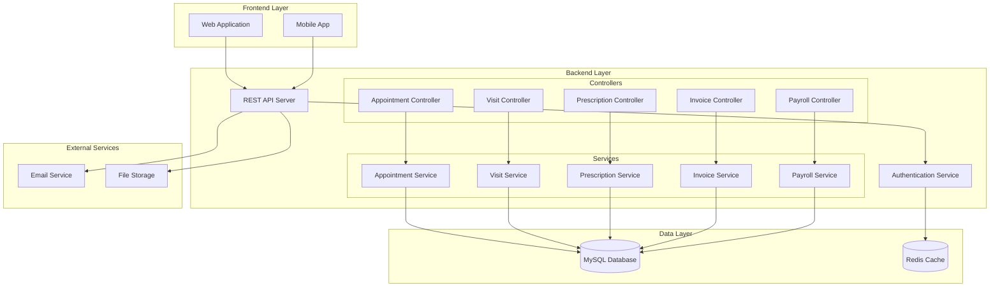
```mermaid
graph TB
    subgraph "Frontend Layer"
        WebApp[Web Application]
        MobileApp[Mobile App]
    end

    subgraph "Backend Layer"
        API[REST API Server]
        Auth[Authentication Service]

        subgraph "Controllers"
            AppointmentCtrl[Appointment Controller]
            VisitCtrl[Visit Controller]
            PrescriptionCtrl[Prescription Controller]
            InvoiceCtrl[Invoice Controller]
            PayrollCtrl[Payroll Controller]
        end

        subgraph "Services"
            AppointmentSvc[Appointment Service]
            VisitSvc[Visit Service]
            PrescriptionSvc[Prescription Service]
            InvoiceSvc[Invoice Service]
            PayrollSvc[Payroll Service]
        end
    end

    subgraph "Data Layer"
        MySQL[(MySQL Database)]
        Redis[(Redis Cache)]
    end

    subgraph "External Services"
        SMTP[Email Service]
        Storage[File Storage]
    end

    WebApp --> API
    MobileApp --> API
    API --> Auth

    AppointmentCtrl --> AppointmentSvc
    VisitCtrl --> VisitSvc
    PrescriptionCtrl --> PrescriptionSvc
    InvoiceCtrl --> InvoiceSvc
    PayrollCtrl --> PayrollSvc

    AppointmentSvc --> MySQL
    VisitSvc --> MySQL
    PrescriptionSvc --> MySQL
    InvoiceSvc --> MySQL
    PayrollSvc --> MySQL

    Auth --> Redis
    API --> SMTP
    API --> Storage
```

### 1.2. Vai Trò Trong Hệ Thống

| Vai Trò          | Mô Tả                  | Quyền Hạn Chính                                |
| ---------------- | ---------------------- | ---------------------------------------------- |
| **ADMIN**        | Quản trị viên hệ thống | Quản lý toàn bộ hệ thống, báo cáo, cấu hình    |
| **RECEPTIONIST** | Lễ tân                 | Đặt lịch offline, check-in bệnh nhân, thu ngân |
| **DOCTOR**       | Bác sĩ                 | Khám bệnh, kê đơn, hoàn thành ca khám          |
| **PATIENT**      | Bệnh nhân              | Đặt lịch online, xem lịch sử khám bệnh         |

---

## 2. Chức Năng Đặt Lịch Hẹn

### 2.1. Mô Tả Chức Năng

**Mục đích:** Cho phép bệnh nhân đặt lịch hẹn khám bệnh với bác sĩ theo ca làm việc và slot trống.

**Đặc điểm nổi bật:**

- ✅ Tự động phân bổ slot (1-40 slot/ngày/bác sĩ)
- ✅ Pessimistic locking để tránh race condition
- ✅ Kiểm tra xung đột lịch trình
- ✅ Thông báo tự động qua email
- ✅ Hỗ trợ đặt lịch online (bệnh nhân) và offline (lễ tân)

### 2.2. Activity Diagram - Luồng Đặt Lịch Hẹn


```mermaid
flowchart TD
    Start([Bắt Đầu]) --> CheckRole{Kiểm tra<br/>vai trò}

    CheckRole -->|Patient| OnlineBooking[Đặt lịch Online]
    CheckRole -->|Receptionist| OfflineBooking[Đặt lịch Offline]

    OnlineBooking --> SelectDoctor[Chọn Bác Sĩ]
    OfflineBooking --> SelectPatient[Chọn Bệnh Nhân]
    SelectPatient --> SelectDoctor

    SelectDoctor --> SelectDate[Chọn Ngày Khám]
    SelectDate --> SelectShift[Chọn Ca Khám<br/>Sáng/Chiều/Tối]

    SelectShift --> StartTransaction[Bắt đầu Transaction]
    StartTransaction --> LockShift[ Lock DoctorShift Row]

    LockShift --> CheckAvailable{Bác sĩ có<br/>làm ca này?}
    CheckAvailable -->|Không| ErrorNotAvailable[Lỗi: Bác sĩ không làm ca này]
    ErrorNotAvailable --> End([Kết Thúc])

    CheckAvailable -->|Có| CountAppointments[Đếm số lịch hẹn trong ngày]
    CountAppointments --> CheckMax{Số lượng<br/>< 40?}

    CheckMax -->|Không| ErrorFull[Lỗi: Đã hết chỗ]
    ErrorFull --> End

    CheckMax -->|Có| GetLastSlot[Lấy slot cuối cùng<br/>trong ca]
    GetLastSlot --> CalculateNext[NextSlot = LastSlot + 1]

    CalculateNext --> TryCreate[Thử tạo Appointment<br/>với NextSlot]
    TryCreate --> CheckUnique{Unique<br/>constraint OK?}

    CheckUnique -->|Vi phạm| IncrementSlot[NextSlot += 1]
    IncrementSlot --> TryCreate

    CheckUnique -->|OK| CreateSuccess[ Tạo Appointment thành công]
    CreateSuccess --> SendNotification[ Gửi thông báo email]
    SendNotification --> Commit[Commit Transaction]
    Commit --> End

    style ErrorNotAvailable fill:#000000
    style ErrorFull fill:#000000
    style CreateSuccess fill:#000000
    style LockShift fill:#000000
```

### 2.3. Sequence Diagram - Đặt Lịch với Pessimistic Locking

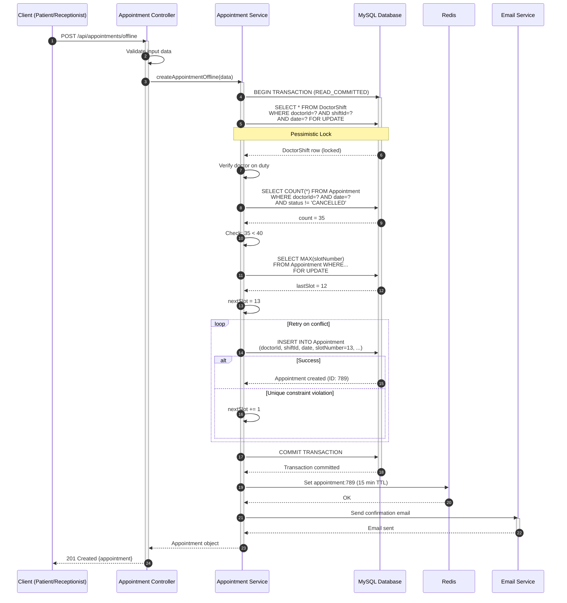
```mermaid
sequenceDiagram
    autonumber
    participant Client as Client (Patient/Receptionist)
    participant Controller as Appointment Controller
    participant Service as Appointment Service
    participant DB as MySQL Database
    participant Cache as Redis
    participant Email as Email Service

    Client->>Controller: POST /api/appointments/offline
    activate Controller

    Controller->>Controller: Validate input data
    Controller->>Service: createAppointmentOffline(data)
    activate Service

    Service->>DB: BEGIN TRANSACTION (READ_COMMITTED)
    activate DB

    Service->>DB: SELECT * FROM DoctorShift<br/>WHERE doctorId=? AND shiftId=?<br/>AND date=? FOR UPDATE
    Note over Service,DB:  Pessimistic Lock

    DB-->>Service: DoctorShift row (locked)

    Service->>Service: Verify doctor on duty

    Service->>DB: SELECT COUNT(*) FROM Appointment<br/>WHERE doctorId=? AND date=?<br/>AND status != 'CANCELLED'
    DB-->>Service: count = 35

    Service->>Service: Check: 35 < 40

    Service->>DB: SELECT MAX(slotNumber)<br/>FROM Appointment WHERE...<br/>FOR UPDATE
    DB-->>Service: lastSlot = 12

    Service->>Service: nextSlot = 13

    loop Retry on conflict
        Service->>DB: INSERT INTO Appointment<br/>(doctorId, shiftId, date, slotNumber=13, ...)
        alt Success
            DB-->>Service: Appointment created (ID: 789)
        else Unique constraint violation
            Service->>Service: nextSlot += 1
        end
    end

    Service->>DB: COMMIT TRANSACTION
    DB-->>Service: Transaction committed
    deactivate DB

    Service->>Cache: Set appointment:789 (15 min TTL)
    Cache-->>Service: OK

    Service->>Email: Send confirmation email
    activate Email
    Email-->>Service: Email sent
    deactivate Email

    Service-->>Controller: Appointment object
    deactivate Service

    Controller-->>Client: 201 Created {appointment}
    deactivate Controller
```

### 2.4. Checklist Kiểm Thử

#### 2.4.1. Test Cases - Đặt Lịch Online (Patient)

| ID      | Mô Tả                                 | Input                                   | Expected Output                          | Status |
| ------- | ------------------------------------- | --------------------------------------- | ---------------------------------------- | ------ |
| APT-001 | Đặt lịch thành công với slot trống    | doctorId=1, shiftId=1, date=2026-01-05  | 201 Created, slotNumber được tự động gán | ⬜     |
| APT-002 | Đặt lịch khi bác sĩ không làm ca đó   | doctorId=1, shiftId=99, date=2026-01-05 | 404 Bác sĩ không làm ca này              | ⬜     |
| APT-003 | Đặt lịch khi đã hết slot (40/40)      | doctorId=1, shiftId=1, date=2026-01-05  | 400 Đã hết chỗ cho ngày này              | ⬜     |
| APT-004 | Race condition - 2 requests đồng thời | 2 clients cùng đặt lịch                 | Cả 2 đều thành công với slot khác nhau   | ⬜     |
| APT-005 | Bệnh nhân đặt lịch trùng giờ          | Patient đã có lịch sáng ngày 5/1        | 400 Bạn đã có lịch hẹn trong ca này      | ⬜     |

#### 2.4.2. Test Cases - Đặt Lịch Offline (Receptionist)

| ID      | Mô Tả                             | Input                             | Expected Output                        | Status |
| ------- | --------------------------------- | --------------------------------- | -------------------------------------- | ------ |
| APT-011 | Lễ tân đặt lịch cho bệnh nhân mới | patientId=null, patientInfo={...} | 201 Created, tự động tạo bệnh nhân mới | ⬜     |
| APT-012 | Lễ tân đặt lịch cho bệnh nhân cũ  | patientId=5                       | 201 Created, liên kết với patient #5   | ⬜     |
| APT-013 | Lễ tân không có quyền truy cập    | Role=PATIENT                      | 403 Forbidden                          | ⬜     |

#### 2.4.3. Test Cases - Hủy Lịch Hẹn

| ID      | Mô Tả                     | Input                      | Expected Output                    | Status |
| ------- | ------------------------- | -------------------------- | ---------------------------------- | ------ |
| APT-021 | Hủy lịch trước 2 giờ      | appointmentTime - now > 2h | 200 OK, status=CANCELLED           | ⬜     |
| APT-022 | Hủy lịch trong vòng 2 giờ | appointmentTime - now < 2h | 400 Phải hủy trước 2 giờ           | ⬜     |
| APT-023 | Hủy lịch đã check-in      | status=CHECKED_IN          | 400 Không thể hủy lịch đã check-in | ⬜     |

---

## 3. Chức Năng Khám Bệnh

### 3.1. Mô Tả Chức Năng

**Mục đích:** Quản lý quy trình khám bệnh từ check-in đến hoàn thành ca khám.

**Đặc điểm nổi bật:**

- ✅ Check-in tự động tạo Visit
- ✅ Ghi nhận triệu chứng, chẩn đoán
- ✅ Hoàn thành ca khám tự động tạo hóa đơn
- ✅ Liên kết với đơn thuốc

### 3.2. Activity Diagram - Quy Trình Khám Bệnh


```mermaid
flowchart TD
    Start([Bệnh Nhân Đến Phòng Khám]) --> HasAppointment{Có lịch hẹn?}

    HasAppointment -->|Không| CreateWalkIn[Tạo lịch Walk-in]
    CreateWalkIn --> CheckIn

    HasAppointment -->|Có| CheckIn[Lễ Tân Check-in]
    CheckIn --> CreateVisit[Tạo Visit Record]
    CreateVisit --> UpdateAppointmentStatus[Cập nhật Appointment<br/>status = CHECKED_IN]
    UpdateAppointmentStatus --> SetCheckInTime[Ghi thời gian check-in]

    SetCheckInTime --> WaitingRoom[Bệnh Nhân Chờ Khám]
    WaitingRoom --> DoctorCalls[Bác Sĩ Gọi Bệnh Nhân]

    DoctorCalls --> RecordSymptoms[Ghi Nhận Triệu Chứng]
    RecordSymptoms --> Examine[Khám Bệnh]
    Examine --> RecordDiagnosis[Ghi Chẩn Đoán]

    RecordDiagnosis --> NeedPrescription{Cần kê<br/>đơn thuốc?}

    NeedPrescription -->|Có| CreatePrescription[Kê Đơn Thuốc<br/>Xem Section 4]
    CreatePrescription --> CompleteVisit

    NeedPrescription -->|Không| CompleteVisit[Hoàn Thành Ca Khám]

    CompleteVisit --> AutoGenerateInvoice[ Tự Động Tạo Hóa Đơn]
    AutoGenerateInvoice --> AddExamFee[Thêm Phí Khám Bệnh]
    AddExamFee --> AddMedicineFees[Thêm Tiền Thuốc<br/>từ Prescription]

    AddMedicineFees --> CalculateTotal[Tính Tổng Tiền]
    CalculateTotal --> UpdateAppointmentComplete[Cập nhật Appointment<br/>status = COMPLETED]

    UpdateAppointmentComplete --> NotifyPatient[ Thông Báo Bệnh Nhân]
    NotifyPatient --> End([Chuyển Sang Thu Ngân])

    style AutoGenerateInvoice fill:#000000
    style CreateVisit fill:#000000
```

### 3.3. Sequence Diagram - Check-in và Tạo Visit

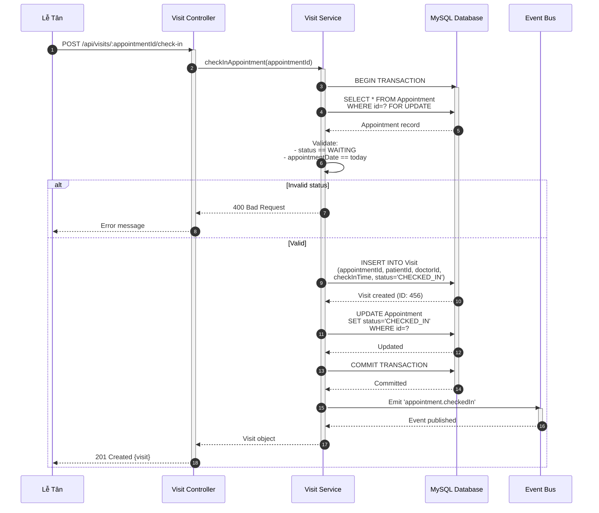
```mermaid
sequenceDiagram
    autonumber
    participant Receptionist as Lễ Tân
    participant Controller as Visit Controller
    participant Service as Visit Service
    participant DB as MySQL Database
    participant EventBus as Event Bus

    Receptionist->>Controller: POST /api/visits/:appointmentId/check-in
    activate Controller

    Controller->>Service: checkInAppointment(appointmentId)
    activate Service

    Service->>DB: BEGIN TRANSACTION
    activate DB

    Service->>DB: SELECT * FROM Appointment<br/>WHERE id=? FOR UPDATE
    DB-->>Service: Appointment record

    Service->>Service: Validate:<br/>- status == WAITING<br/>- appointmentDate == today

    alt Invalid status
        Service-->>Controller: 400 Bad Request
        Controller-->>Receptionist: Error message
    else Valid
        Service->>DB: INSERT INTO Visit<br/>(appointmentId, patientId, doctorId,<br/>checkInTime, status='CHECKED_IN')
        DB-->>Service: Visit created (ID: 456)

        Service->>DB: UPDATE Appointment<br/>SET status='CHECKED_IN'<br/>WHERE id=?
        DB-->>Service: Updated

        Service->>DB: COMMIT TRANSACTION
        DB-->>Service: Committed
        deactivate DB

        Service->>EventBus: Emit 'appointment.checkedIn'
        activate EventBus
        EventBus-->>Service: Event published
        deactivate EventBus

        Service-->>Controller: Visit object
        deactivate Service

        Controller-->>Receptionist: 201 Created {visit}
        deactivate Controller
    end
```

### 3.4. Sequence Diagram - Hoàn Thành Ca Khám và Tự Động Tạo Invoice

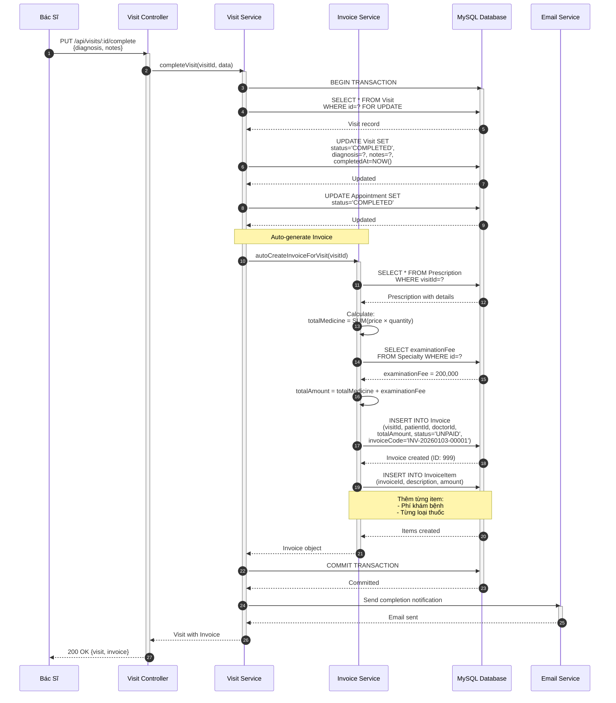
```mermaid
sequenceDiagram
    autonumber
    participant Doctor as Bác Sĩ
    participant Controller as Visit Controller
    participant VisitService as Visit Service
    participant InvoiceService as Invoice Service
    participant DB as MySQL Database
    participant Email as Email Service

    Doctor->>Controller: PUT /api/visits/:id/complete<br/>{diagnosis, notes}
    activate Controller

    Controller->>VisitService: completeVisit(visitId, data)
    activate VisitService

    VisitService->>DB: BEGIN TRANSACTION
    activate DB

    VisitService->>DB: SELECT * FROM Visit<br/>WHERE id=? FOR UPDATE
    DB-->>VisitService: Visit record

    VisitService->>DB: UPDATE Visit SET<br/>status='COMPLETED',<br/>diagnosis=?, notes=?,<br/>completedAt=NOW()
    DB-->>VisitService: Updated

    VisitService->>DB: UPDATE Appointment SET<br/>status='COMPLETED'
    DB-->>VisitService: Updated

    Note over VisitService,InvoiceService:  Auto-generate Invoice

    VisitService->>InvoiceService: autoCreateInvoiceForVisit(visitId)
    activate InvoiceService

    InvoiceService->>DB: SELECT * FROM Prescription<br/>WHERE visitId=?
    DB-->>InvoiceService: Prescription with details

    InvoiceService->>InvoiceService: Calculate:<br/>totalMedicine = SUM(price × quantity)

    InvoiceService->>DB: SELECT examinationFee<br/>FROM Specialty WHERE id=?
    DB-->>InvoiceService: examinationFee = 200,000

    InvoiceService->>InvoiceService: totalAmount = totalMedicine + examinationFee

    InvoiceService->>DB: INSERT INTO Invoice<br/>(visitId, patientId, doctorId,<br/>totalAmount, status='UNPAID',<br/>invoiceCode='INV-20260103-00001')
    DB-->>InvoiceService: Invoice created (ID: 999)

    InvoiceService->>DB: INSERT INTO InvoiceItem<br/>(invoiceId, description, amount)
    Note over InvoiceService,DB: Thêm từng item:<br/>- Phí khám bệnh<br/>- Từng loại thuốc
    DB-->>InvoiceService: Items created

    InvoiceService-->>VisitService: Invoice object
    deactivate InvoiceService

    VisitService->>DB: COMMIT TRANSACTION
    DB-->>VisitService: Committed
    deactivate DB

    VisitService->>Email: Send completion notification
    activate Email
    Email-->>VisitService: Email sent
    deactivate Email

    VisitService-->>Controller: Visit with Invoice
    deactivate VisitService

    Controller-->>Doctor: 200 OK {visit, invoice}
    deactivate Controller
```

### 3.5. Checklist Kiểm Thử

#### 3.5.1. Test Cases - Check-in

| ID      | Mô Tả                     | Input                                | Expected Output                    | Status |
| ------- | ------------------------- | ------------------------------------ | ---------------------------------- | ------ |
| VST-001 | Check-in lịch hẹn hợp lệ  | appointmentId=123, status=WAITING    | 201 Created, Visit tạo thành công  | ⬜     |
| VST-002 | Check-in lịch đã check-in | appointmentId=123, status=CHECKED_IN | 400 Lịch hẹn đã được check-in      | ⬜     |
| VST-003 | Check-in lịch đã hủy      | appointmentId=123, status=CANCELLED  | 400 Không thể check-in lịch đã hủy | ⬜     |
| VST-004 | Check-in không đúng ngày  | appointmentDate != today             | 400 Chỉ check-in trong ngày hẹn    | ⬜     |

#### 3.5.2. Test Cases - Hoàn Thành Ca Khám

| ID      | Mô Tả                                 | Input                              | Expected Output                            | Status |
| ------- | ------------------------------------- | ---------------------------------- | ------------------------------------------ | ------ |
| VST-011 | Hoàn thành ca khám có đơn thuốc       | visitId=456, có prescription       | 200 OK, Invoice tự động tạo với tiền thuốc | ⬜     |
| VST-012 | Hoàn thành ca khám không có đơn thuốc | visitId=456, không có prescription | 200 OK, Invoice chỉ có phí khám            | ⬜     |
| VST-013 | Hoàn thành ca khám đã complete        | visitId=456, status=COMPLETED      | 400 Ca khám đã hoàn thành                  | ⬜     |
| VST-014 | Bác sĩ khác cố hoàn thành ca          | doctorId != visit.doctorId         | 403 Forbidden                              | ⬜     |

---

## 4. Chức Năng Kê Đơn Thuốc

### 4.1. Mô Tả Chức Năng

**Mục đích:** Bác sĩ kê đơn thuốc với tự động trừ kho và snapshot giá.

**Đặc điểm nổi bật:**

- ✅ Pessimistic locking khi trừ tồn kho
- ✅ Snapshot giá tại thời điểm kê đơn
- ✅ Tự động khôi phục tồn kho khi hủy đơn
- ✅ Khóa đơn thuốc sau khi thanh toán
- ✅ Xuất PDF đơn thuốc

### 4.2. Activity Diagram - Kê Đơn Thuốc với Stock Deduction


```mermaid
flowchart TD
    Start([Bác Sĩ Kê Đơn]) --> SelectMedicines[Chọn Các Loại Thuốc<br/>và Số Lượng]
    SelectMedicines --> StartTxn[Bắt Đầu Transaction]

    StartTxn --> LoopStart{Duyệt Qua<br/>Từng Thuốc}

    LoopStart -->|Còn thuốc| LockMedicine[ Lock Medicine Row<br/>FOR UPDATE]
    LockMedicine --> CheckStock{Tồn kho<br/>>= Số lượng?}

    CheckStock -->|Không| RollbackNotEnough[ Rollback: Không đủ thuốc]
    RollbackNotEnough --> End([Kết Thúc])

    CheckStock -->|Có| DeductStock[Trừ Tồn Kho<br/>stock -= quantity]
    DeductStock --> SnapshotPrice[Lưu Giá Hiện Tại<br/>vào PrescriptionDetail]

    SnapshotPrice --> SaveMedicine[UPDATE Medicine]
    SaveMedicine --> CreateDetail[INSERT PrescriptionDetail]
    CreateDetail --> LoopStart

    LoopStart -->|Hết thuốc| CalculateTotal[Tính Tổng Tiền Thuốc]
    CalculateTotal --> GenerateCode[Tạo Prescription Code<br/>RX-YYYYMMDD-NNNNN]

    GenerateCode --> SavePrescription[INSERT Prescription<br/>status = DRAFT]
    SavePrescription --> Commit[Commit Transaction]

    Commit --> NotifySuccess[ Kê Đơn Thành Công]
    NotifySuccess --> End

    style RollbackNotEnough fill:#000000
    style NotifySuccess fill:#000000
    style LockMedicine fill:#000000
```

### 4.3. Sequence Diagram - Tạo Đơn Thuốc với Pessimistic Locking

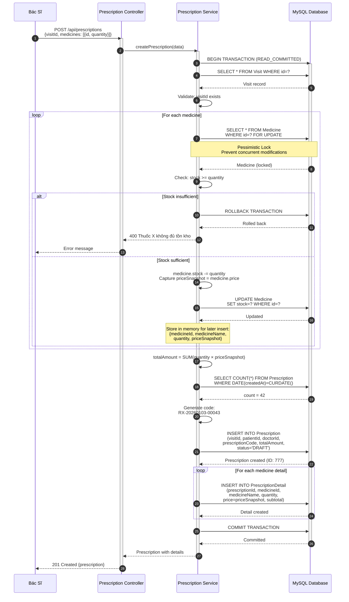
```mermaid
sequenceDiagram
    autonumber
    participant Doctor as Bác Sĩ
    participant Controller as Prescription Controller
    participant Service as Prescription Service
    participant DB as MySQL Database

    Doctor->>Controller: POST /api/prescriptions<br/>{visitId, medicines: [{id, quantity}]}
    activate Controller

    Controller->>Service: createPrescription(data)
    activate Service

    Service->>DB: BEGIN TRANSACTION (READ_COMMITTED)
    activate DB

    Service->>DB: SELECT * FROM Visit WHERE id=?
    DB-->>Service: Visit record

    Service->>Service: Validate: visitId exists

    loop For each medicine
        Service->>DB: SELECT * FROM Medicine<br/>WHERE id=? FOR UPDATE
        Note over Service,DB:  Pessimistic Lock<br/>Prevent concurrent modifications
        DB-->>Service: Medicine (locked)

        Service->>Service: Check: stock >= quantity

        alt Stock insufficient
            Service->>DB: ROLLBACK TRANSACTION
            DB-->>Service: Rolled back
            Service-->>Controller: 400 Thuốc X không đủ tồn kho
            Controller-->>Doctor: Error message
        else Stock sufficient
            Service->>Service: medicine.stock -= quantity<br/>Capture priceSnapshot = medicine.price

            Service->>DB: UPDATE Medicine<br/>SET stock=? WHERE id=?
            DB-->>Service: Updated

            Note over Service: Store in memory for later insert:<br/>{medicineId, medicineName,<br/>quantity, priceSnapshot}
        end
    end

    Service->>Service: totalAmount = SUM(quantity × priceSnapshot)

    Service->>DB: SELECT COUNT(*) FROM Prescription<br/>WHERE DATE(createdAt)=CURDATE()
    DB-->>Service: count = 42

    Service->>Service: Generate code:<br/>RX-20260103-00043

    Service->>DB: INSERT INTO Prescription<br/>(visitId, patientId, doctorId,<br/>prescriptionCode, totalAmount,<br/>status='DRAFT')
    DB-->>Service: Prescription created (ID: 777)

    loop For each medicine detail
        Service->>DB: INSERT INTO PrescriptionDetail<br/>(prescriptionId, medicineId,<br/>medicineName, quantity,<br/>price=priceSnapshot, subtotal)
        DB-->>Service: Detail created
    end

    Service->>DB: COMMIT TRANSACTION
    DB-->>Service: Committed
    deactivate DB

    Service-->>Controller: Prescription with details
    deactivate Service

    Controller-->>Doctor: 201 Created {prescription}
    deactivate Controller
```

### 4.4. Sequence Diagram - Hủy Đơn Thuốc và Khôi Phục Tồn Kho

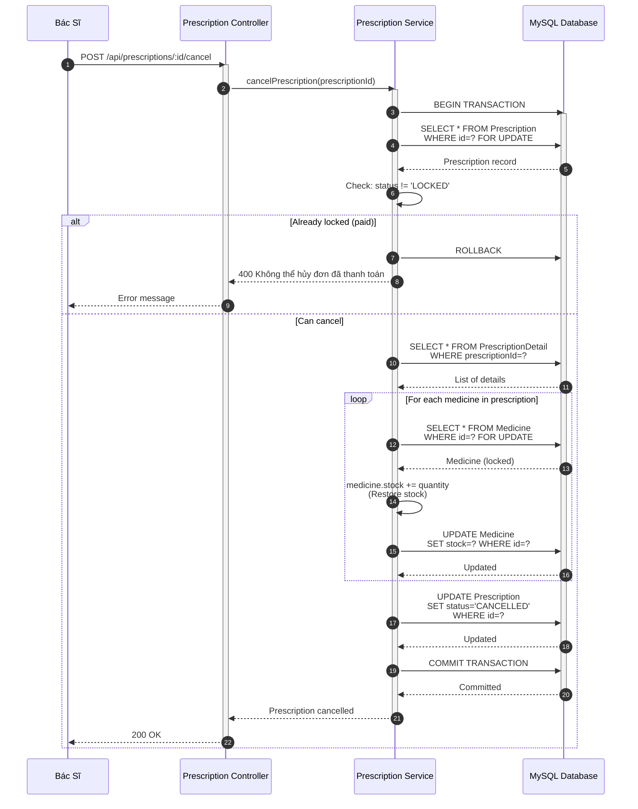
```mermaid
sequenceDiagram
    autonumber
    participant Doctor as Bác Sĩ
    participant Controller as Prescription Controller
    participant Service as Prescription Service
    participant DB as MySQL Database

    Doctor->>Controller: POST /api/prescriptions/:id/cancel
    activate Controller

    Controller->>Service: cancelPrescription(prescriptionId)
    activate Service

    Service->>DB: BEGIN TRANSACTION
    activate DB

    Service->>DB: SELECT * FROM Prescription<br/>WHERE id=? FOR UPDATE
    DB-->>Service: Prescription record

    Service->>Service: Check: status != 'LOCKED'

    alt Already locked (paid)
        Service->>DB: ROLLBACK
        Service-->>Controller: 400 Không thể hủy đơn đã thanh toán
        Controller-->>Doctor: Error message
    else Can cancel
        Service->>DB: SELECT * FROM PrescriptionDetail<br/>WHERE prescriptionId=?
        DB-->>Service: List of details

        loop For each medicine in prescription
            Service->>DB: SELECT * FROM Medicine<br/>WHERE id=? FOR UPDATE
            DB-->>Service: Medicine (locked)

            Service->>Service: medicine.stock += quantity<br/>(Restore stock)

            Service->>DB: UPDATE Medicine<br/>SET stock=? WHERE id=?
            DB-->>Service: Updated
        end

        Service->>DB: UPDATE Prescription<br/>SET status='CANCELLED'<br/>WHERE id=?
        DB-->>Service: Updated

        Service->>DB: COMMIT TRANSACTION
        DB-->>Service: Committed
        deactivate DB

        Service-->>Controller: Prescription cancelled
        deactivate Service

        Controller-->>Doctor: 200 OK
        deactivate Controller
    end
```

### 4.5. State Machine - Trạng Thái Đơn Thuốc

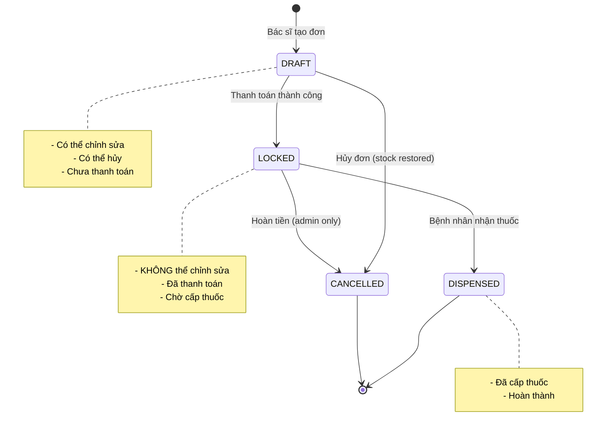
```mermaid
stateDiagram-v2
    [*] --> DRAFT: Bác sĩ tạo đơn

    DRAFT --> LOCKED: Thanh toán thành công
    DRAFT --> CANCELLED: Hủy đơn (stock restored)

    LOCKED --> DISPENSED: Bệnh nhân nhận thuốc
    LOCKED --> CANCELLED: Hoàn tiền (admin only)

    DISPENSED --> [*]
    CANCELLED --> [*]

    note right of DRAFT
        - Có thể chỉnh sửa
        - Có thể hủy
        - Chưa thanh toán
    end note

    note right of LOCKED
        - KHÔNG thể chỉnh sửa
        - Đã thanh toán
        - Chờ cấp thuốc
    end note

    note right of DISPENSED
        - Đã cấp thuốc
        - Hoàn thành
    end note
```

### 4.6. Checklist Kiểm Thử

#### 4.6.1. Test Cases - Tạo Đơn Thuốc

| ID      | Mô Tả                                   | Input                                      | Expected Output                                        | Status |
| ------- | --------------------------------------- | ------------------------------------------ | ------------------------------------------------------ | ------ |
| PRE-001 | Kê đơn thành công với tồn kho đủ        | [{medicineId=1, quantity=5}], stock=100    | 201 Created, stock=95                                  | ⬜     |
| PRE-002 | Kê đơn khi không đủ tồn kho             | [{medicineId=1, quantity=150}], stock=100  | 400 Thuốc X không đủ tồn kho                           | ⬜     |
| PRE-003 | Kê đơn nhiều thuốc, 1 thuốc hết         | medicines=[{id=1, qty=5}, {id=2, qty=200}] | 400 Thuốc Y không đủ, toàn bộ rollback                 | ⬜     |
| PRE-004 | Snapshot giá đúng                       | medicine.price=10,000 tại T1               | PrescriptionDetail.price=10,000 dù sau đó giá thay đổi | ⬜     |
| PRE-005 | Race condition - 2 bác sĩ kê cùng thuốc | 2 doctors cùng kê paracetamol              | Cả 2 thành công, stock trừ chính xác                   | ⬜     |

#### 4.6.2. Test Cases - Hủy Đơn Thuốc

| ID      | Mô Tả                       | Input                                | Expected Output                          | Status |
| ------- | --------------------------- | ------------------------------------ | ---------------------------------------- | ------ |
| PRE-011 | Hủy đơn DRAFT               | prescriptionId=777, status=DRAFT     | 200 OK, stock khôi phục đúng             | ⬜     |
| PRE-012 | Hủy đơn đã LOCKED           | prescriptionId=777, status=LOCKED    | 400 Không thể hủy đơn đã thanh toán      | ⬜     |
| PRE-013 | Hủy đơn DISPENSED           | prescriptionId=777, status=DISPENSED | 400 Không thể hủy đơn đã cấp thuốc       | ⬜     |
| PRE-014 | Khôi phục tồn kho chính xác | Cancel prescription có 3 loại thuốc  | Stock mỗi loại tăng đúng số lượng đã trừ | ⬜     |

#### 4.6.3. Test Cases - Khóa Đơn Thuốc

| ID      | Mô Tả                       | Input                                 | Expected Output              | Status |
| ------- | --------------------------- | ------------------------------------- | ---------------------------- | ------ |
| PRE-021 | Khóa đơn sau khi thanh toán | Invoice paid → auto lock prescription | Prescription.status = LOCKED | ⬜     |
| PRE-022 | Không thể sửa đơn đã khóa   | PUT /prescriptions/:id, status=LOCKED | 400 Không thể chỉnh sửa      | ⬜     |

---

## 5. Chức Năng Thanh Toán

### 5.1. Mô Tả Chức Năng

**Mục đích:** Quản lý thanh toán hóa đơn với hỗ trợ thanh toán từng phần.

**Đặc điểm nổi bật:**

- ✅ Thanh toán từng phần (partial payment)
- ✅ Nhiều phương thức thanh toán (Cash, Bank, QR, Credit Card)
- ✅ Tự động khóa đơn thuốc khi thanh toán đủ
- ✅ Lịch sử thanh toán chi tiết
- ✅ Xuất PDF hóa đơn

### 5.2. Activity Diagram - Quy Trình Thanh Toán


```mermaid
flowchart TD
    Start([Bệnh Nhân Đến Thu Ngân]) --> GetInvoice[Lấy Hóa Đơn từ Visit]
    GetInvoice --> DisplayAmount[Hiển Thị Tổng Tiền<br/>và Số Tiền Đã Trả]

    DisplayAmount --> CalculateRemaining[Tính Số Tiền Còn Lại<br/>remaining = total - paid]

    CalculateRemaining --> PatientInput[Bệnh Nhân Nhập Số Tiền Thanh Toán]
    PatientInput --> SelectMethod[Chọn Phương Thức<br/>Cash/Bank/QR/Card]

    SelectMethod --> Validate{Validate<br/>payment amount}

    Validate -->|amount <= 0| ErrorInvalid[ Lỗi: Số tiền không hợp lệ]
    ErrorInvalid --> End([Kết Thúc])

    Validate -->|amount > remaining| ErrorExcess[ Lỗi: Vượt quá số tiền còn lại]
    ErrorExcess --> End

    Validate -->|Valid| StartTxn[Bắt Đầu Transaction]

    StartTxn --> CreatePayment[Tạo Payment Record]
    CreatePayment --> UpdateInvoicePaid[Cập Nhật invoice.paidAmount<br/>+= payment.amount]

    UpdateInvoicePaid --> CheckFullyPaid{paidAmount<br/>== totalAmount?}

    CheckFullyPaid -->|Chưa đủ| UpdatePartialPaid[Cập Nhật paymentStatus<br/>= PARTIAL_PAID]
    UpdatePartialPaid --> Commit

    CheckFullyPaid -->|Đã đủ| UpdateFullyPaid[Cập Nhật paymentStatus<br/>= PAID]
    UpdateFullyPaid --> LockPrescription[ Khóa Đơn Thuốc<br/>status = LOCKED]
    LockPrescription --> Commit[Commit Transaction]

    Commit --> SendReceipt[ Gửi Hóa Đơn Điện Tử]
    SendReceipt --> PrintReceipt[In Hóa Đơn/PDF]
    PrintReceipt --> Success[ Thanh Toán Thành Công]
    Success --> End

    style ErrorInvalid fill:#000000
    style ErrorExcess fill:#000000
    style Success fill:#000000
    style LockPrescription fill:#000000
```

### 5.3. Sequence Diagram - Thanh Toán với Partial Payment

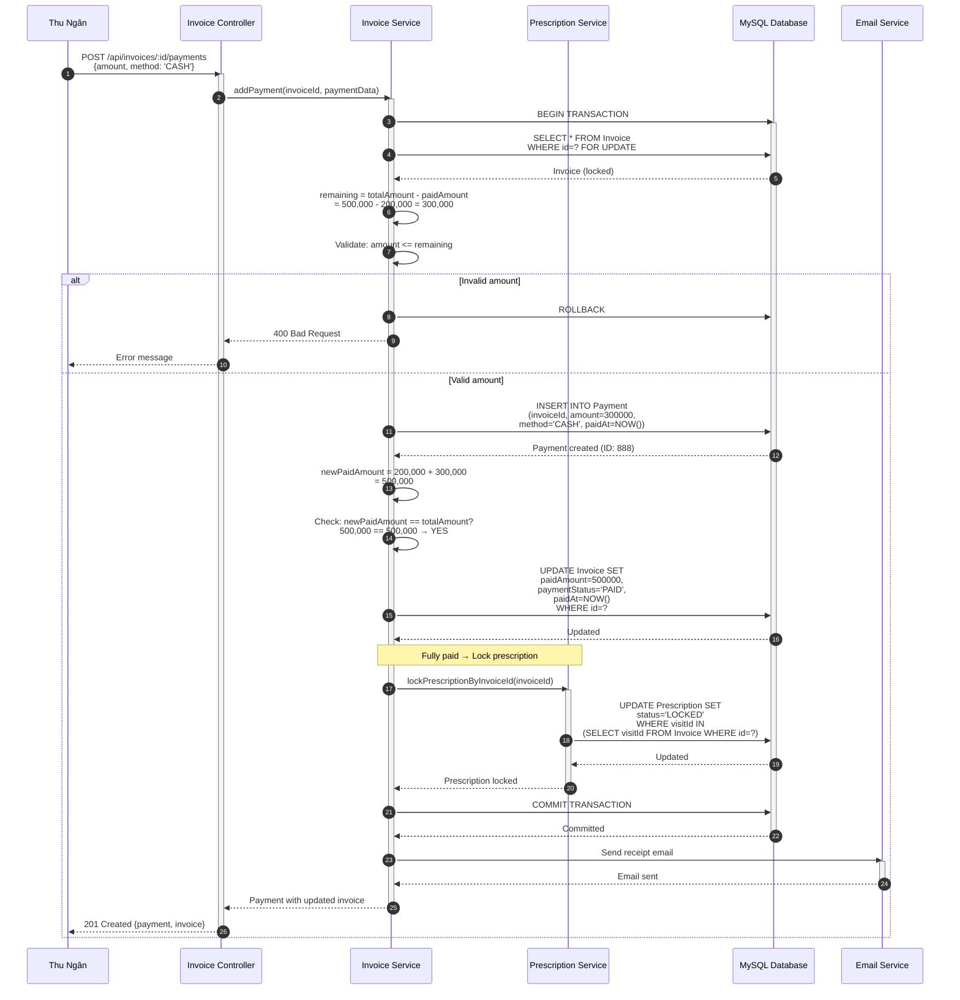
```mermaid
sequenceDiagram
    autonumber
    participant Cashier as Thu Ngân
    participant Controller as Invoice Controller
    participant Service as Invoice Service
    participant PrescriptionService as Prescription Service
    participant DB as MySQL Database
    participant Email as Email Service

    Cashier->>Controller: POST /api/invoices/:id/payments<br/>{amount, method: 'CASH'}
    activate Controller

    Controller->>Service: addPayment(invoiceId, paymentData)
    activate Service

    Service->>DB: BEGIN TRANSACTION
    activate DB

    Service->>DB: SELECT * FROM Invoice<br/>WHERE id=? FOR UPDATE
    DB-->>Service: Invoice (locked)

    Service->>Service: remaining = totalAmount - paidAmount<br/>= 500,000 - 200,000 = 300,000

    Service->>Service: Validate: amount <= remaining

    alt Invalid amount
        Service->>DB: ROLLBACK
        Service-->>Controller: 400 Bad Request
        Controller-->>Cashier: Error message
    else Valid amount
        Service->>DB: INSERT INTO Payment<br/>(invoiceId, amount=300000,<br/>method='CASH', paidAt=NOW())
        DB-->>Service: Payment created (ID: 888)

        Service->>Service: newPaidAmount = 200,000 + 300,000<br/>= 500,000

        Service->>Service: Check: newPaidAmount == totalAmount?<br/>500,000 == 500,000 → YES

        Service->>DB: UPDATE Invoice SET<br/>paidAmount=500000,<br/>paymentStatus='PAID',<br/>paidAt=NOW()<br/>WHERE id=?
        DB-->>Service: Updated

        Note over Service,PrescriptionService: Fully paid → Lock prescription

        Service->>PrescriptionService: lockPrescriptionByInvoiceId(invoiceId)
        activate PrescriptionService

        PrescriptionService->>DB: UPDATE Prescription SET<br/>status='LOCKED'<br/>WHERE visitId IN<br/>(SELECT visitId FROM Invoice WHERE id=?)
        DB-->>PrescriptionService: Updated

        PrescriptionService-->>Service: Prescription locked
        deactivate PrescriptionService

        Service->>DB: COMMIT TRANSACTION
        DB-->>Service: Committed
        deactivate DB

        Service->>Email: Send receipt email
        activate Email
        Email-->>Service: Email sent
        deactivate Email

        Service-->>Controller: Payment with updated invoice
        deactivate Service

        Controller-->>Cashier: 201 Created {payment, invoice}
        deactivate Controller
    end
```

### 5.4. State Machine - Trạng Thái Thanh Toán

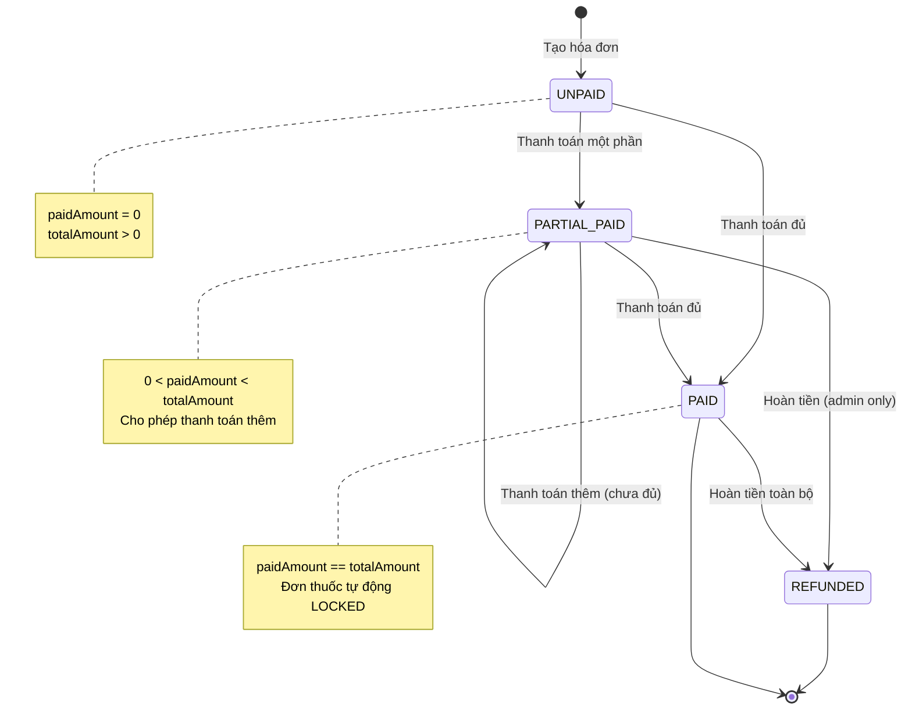
```mermaid
stateDiagram-v2
    [*] --> UNPAID: Tạo hóa đơn

    UNPAID --> PARTIAL_PAID: Thanh toán một phần
    UNPAID --> PAID: Thanh toán đủ

    PARTIAL_PAID --> PARTIAL_PAID: Thanh toán thêm (chưa đủ)
    PARTIAL_PAID --> PAID: Thanh toán đủ
    PARTIAL_PAID --> REFUNDED: Hoàn tiền (admin only)

    PAID --> REFUNDED: Hoàn tiền toàn bộ

    REFUNDED --> [*]
    PAID --> [*]

    note right of UNPAID
        paidAmount = 0
        totalAmount > 0
    end note

    note right of PARTIAL_PAID
        0 < paidAmount < totalAmount
        Cho phép thanh toán thêm
    end note

    note right of PAID
        paidAmount == totalAmount
        Đơn thuốc tự động LOCKED
    end note
```

### 5.5. Checklist Kiểm Thử

#### 5.5.1. Test Cases - Thanh Toán

| ID      | Mô Tả                               | Input                            | Expected Output                               | Status |
| ------- | ----------------------------------- | -------------------------------- | --------------------------------------------- | ------ |
| INV-001 | Thanh toán đủ 1 lần                 | totalAmount=500k, payment=500k   | 201 Created, status=PAID, prescription LOCKED | ⬜     |
| INV-002 | Thanh toán từng phần (2 lần)        | total=500k, pay1=200k, pay2=300k | Lần 1: PARTIAL_PAID, Lần 2: PAID              | ⬜     |
| INV-003 | Thanh toán vượt quá số tiền         | total=500k, paid=200k, pay=400k  | 400 Vượt quá số tiền còn lại (300k)           | ⬜     |
| INV-004 | Thanh toán số tiền âm               | amount=-100k                     | 400 Số tiền không hợp lệ                      | ⬜     |
| INV-005 | Thanh toán hóa đơn đã thanh toán đủ | status=PAID, payment=100k        | 400 Hóa đơn đã thanh toán đủ                  | ⬜     |

#### 5.5.2. Test Cases - Phương Thức Thanh Toán

| ID      | Mô Tả                        | Input                | Expected Output                | Status |
| ------- | ---------------------------- | -------------------- | ------------------------------ | ------ |
| INV-011 | Thanh toán bằng tiền mặt     | method=CASH          | Payment.method='CASH'          | ⬜     |
| INV-012 | Thanh toán bằng chuyển khoản | method=BANK_TRANSFER | Payment.method='BANK_TRANSFER' | ⬜     |
| INV-013 | Thanh toán bằng QR Code      | method=QR_CODE       | Payment.method='QR_CODE'       | ⬜     |
| INV-014 | Thanh toán bằng thẻ tín dụng | method=CREDIT_CARD   | Payment.method='CREDIT_CARD'   | ⬜     |

#### 5.5.3. Test Cases - Export PDF

| ID      | Mô Tả              | Input                      | Expected Output               | Status |
| ------- | ------------------ | -------------------------- | ----------------------------- | ------ |
| INV-021 | Xuất PDF hóa đơn   | GET /invoices/:id/pdf      | PDF file với thông tin đầy đủ | ⬜     |
| INV-022 | Xuất PDF đơn thuốc | GET /prescriptions/:id/pdf | PDF file với danh sách thuốc  | ⬜     |

---

## 6. Chức Năng Tính Lương

### 6.1. Mô Tả Chức Năng

**Mục đích:** Tính lương tự động cho nhân viên với công thức phức tạp.

**Công thức tính lương:**

```
Lương Cơ Bản = baseSalary × roleCoefficient
Thưởng Kinh Nghiệm = yearsOfService × 200,000 VND
Hoa Hồng (Chỉ Bác Sĩ) = totalInvoices × 5%
Phạt Nghỉ = (daysOff - 2) × 200,000 VND (nếu nghỉ > 2 ngày/tháng)

Lương Gộp = Lương Cơ Bản + Thưởng Kinh Nghiệm + Hoa Hồng
Lương Thực Nhận = Lương Gộp - Phạt Nghỉ
```

**Hệ Số Vai Trò:**

- ADMIN: 2.0
- DOCTOR: 1.8
- RECEPTIONIST: 1.2
- PATIENT: 0 (không tính lương)

### 6.2. Activity Diagram - Quy Trình Tính Lương

```mermaid
flowchart TD
    Start([HR Chọn Tính Lương]) --> SelectPeriod[Chọn Tháng/Năm]
    SelectPeriod --> SelectEmployee{Chọn<br/>Nhân Viên}

    SelectEmployee -->|Single| CalculateSingle[Tính Lương 1 Người]
    SelectEmployee -->|All| CalculateBatch[Tính Lương Hàng Loạt]

    CalculateBatch --> LoopEmployees[Duyệt Qua Từng Nhân Viên]
    LoopEmployees --> CalculateSingle

    CalculateSingle --> GetUserInfo[Lấy Thông Tin User<br/>Role, hireDate]
    GetUserInfo --> CalculateYears[Tính Số Năm Làm Việc<br/>= YEAR(NOW) - YEAR(hireDate)]

    CalculateYears --> CalculateBase[Lương Cơ Bản<br/>= baseSalary × roleCoefficient]
    CalculateBase --> CalculateExperience[Thưởng Kinh Nghiệm<br/>= years × 200,000]

    CalculateExperience --> CheckRole{Vai trò<br/>== DOCTOR?}

    CheckRole -->|Không| CommissionZero[Hoa Hồng = 0]
    CheckRole -->|Có| GetInvoices[Lấy Invoices của Doctor<br/>trong tháng]
    GetInvoices --> CalculateCommission[Hoa Hồng<br/>= SUM(invoices) × 5%]

    CommissionZero --> CalculateGross
    CalculateCommission --> CalculateGross[Lương Gộp<br/>= Base + Experience + Commission]

    CalculateGross --> GetAttendance[Lấy Dữ Liệu Chấm Công<br/>trong tháng]
    GetAttendance --> CountDaysOff[Đếm Số Ngày Nghỉ]

    CountDaysOff --> CheckAbsence{Nghỉ<br/>> 2 ngày?}

    CheckAbsence -->|Không| PenaltyZero[Phạt = 0]
    CheckAbsence -->|Có| CalculatePenalty[Phạt<br/>= (daysOff - 2) × 200,000]

    PenaltyZero --> CalculateNet
    CalculatePenalty --> CalculateNet[Lương Thực Nhận<br/>= Gross - Penalty]

    CalculateNet --> GenerateCode[Tạo Payroll Code<br/>PAY-YYYYMM-NNNNN]
    GenerateCode --> SavePayroll[Lưu Payroll Record<br/>status = DRAFT]

    SavePayroll --> CheckBatch{Tính<br/>hàng loạt?}

    CheckBatch -->|Có| LoopEmployees
    CheckBatch -->|Không| NotifyHR[ Thông Báo HR]

    NotifyHR --> End([Chờ Duyệt])

    style CalculateNet fill:#000000
```

### 6.3. Sequence Diagram - Tính Lương Bác Sĩ (Có Hoa Hồng)

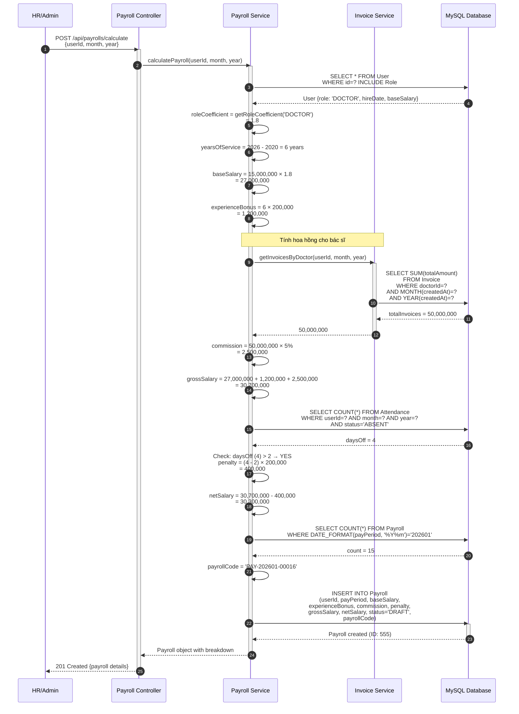
```mermaid
sequenceDiagram
    autonumber
    participant HR as HR/Admin
    participant Controller as Payroll Controller
    participant Service as Payroll Service
    participant InvoiceService as Invoice Service
    participant DB as MySQL Database

    HR->>Controller: POST /api/payrolls/calculate<br/>{userId, month, year}
    activate Controller

    Controller->>Service: calculatePayroll(userId, month, year)
    activate Service

    Service->>DB: SELECT * FROM User<br/>WHERE id=? INCLUDE Role
    DB-->>Service: User {role: 'DOCTOR', hireDate, baseSalary}

    Service->>Service: roleCoefficient = getRoleCoefficient('DOCTOR')<br/>= 1.8

    Service->>Service: yearsOfService = 2026 - 2020 = 6 years

    Service->>Service: baseSalary = 15,000,000 × 1.8<br/>= 27,000,000

    Service->>Service: experienceBonus = 6 × 200,000<br/>= 1,200,000

    Note over Service,InvoiceService: Tính hoa hồng cho bác sĩ

    Service->>InvoiceService: getInvoicesByDoctor(userId, month, year)
    activate InvoiceService

    InvoiceService->>DB: SELECT SUM(totalAmount)<br/>FROM Invoice<br/>WHERE doctorId=?<br/>AND MONTH(createdAt)=?<br/>AND YEAR(createdAt)=?
    DB-->>InvoiceService: totalInvoices = 50,000,000

    InvoiceService-->>Service: 50,000,000
    deactivate InvoiceService

    Service->>Service: commission = 50,000,000 × 5%<br/>= 2,500,000

    Service->>Service: grossSalary = 27,000,000 + 1,200,000 + 2,500,000<br/>= 30,700,000

    Service->>DB: SELECT COUNT(*) FROM Attendance<br/>WHERE userId=? AND month=? AND year=?<br/>AND status='ABSENT'
    DB-->>Service: daysOff = 4

    Service->>Service: Check: daysOff (4) > 2 → YES<br/>penalty = (4 - 2) × 200,000<br/>= 400,000

    Service->>Service: netSalary = 30,700,000 - 400,000<br/>= 30,300,000

    Service->>DB: SELECT COUNT(*) FROM Payroll<br/>WHERE DATE_FORMAT(payPeriod, '%Y%m')='202601'
    DB-->>Service: count = 15

    Service->>Service: payrollCode = 'PAY-202601-00016'

    Service->>DB: INSERT INTO Payroll<br/>(userId, payPeriod, baseSalary,<br/>experienceBonus, commission, penalty,<br/>grossSalary, netSalary, status='DRAFT',<br/>payrollCode)
    activate DB
    DB-->>Service: Payroll created (ID: 555)
    deactivate DB

    Service-->>Controller: Payroll object with breakdown
    deactivate Service

    Controller-->>HR: 201 Created {payroll details}
    deactivate Controller
```

### 6.4. Sequence Diagram - Duyệt và Thanh Toán Lương

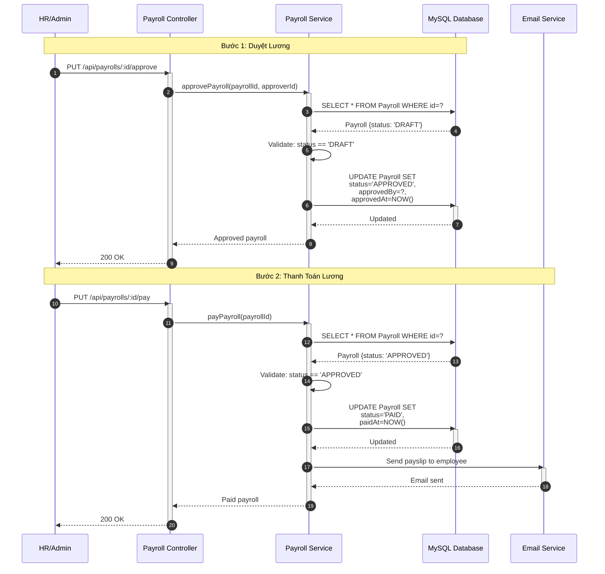
```mermaid
sequenceDiagram
    autonumber
    participant HR as HR/Admin
    participant Controller as Payroll Controller
    participant Service as Payroll Service
    participant DB as MySQL Database
    participant Email as Email Service

    Note over HR,DB: Bước 1: Duyệt Lương

    HR->>Controller: PUT /api/payrolls/:id/approve
    activate Controller

    Controller->>Service: approvePayroll(payrollId, approverId)
    activate Service

    Service->>DB: SELECT * FROM Payroll WHERE id=?
    DB-->>Service: Payroll {status: 'DRAFT'}

    Service->>Service: Validate: status == 'DRAFT'

    Service->>DB: UPDATE Payroll SET<br/>status='APPROVED',<br/>approvedBy=?,<br/>approvedAt=NOW()
    activate DB
    DB-->>Service: Updated
    deactivate DB

    Service-->>Controller: Approved payroll
    deactivate Service

    Controller-->>HR: 200 OK
    deactivate Controller

    Note over HR,Email: Bước 2: Thanh Toán Lương

    HR->>Controller: PUT /api/payrolls/:id/pay
    activate Controller

    Controller->>Service: payPayroll(payrollId)
    activate Service

    Service->>DB: SELECT * FROM Payroll WHERE id=?
    DB-->>Service: Payroll {status: 'APPROVED'}

    Service->>Service: Validate: status == 'APPROVED'

    Service->>DB: UPDATE Payroll SET<br/>status='PAID',<br/>paidAt=NOW()
    activate DB
    DB-->>Service: Updated
    deactivate DB

    Service->>Email: Send payslip to employee
    activate Email
    Email-->>Service: Email sent
    deactivate Email

    Service-->>Controller: Paid payroll
    deactivate Service

    Controller-->>HR: 200 OK
    deactivate Controller
```

### 6.5. State Machine - Trạng Thái Lương

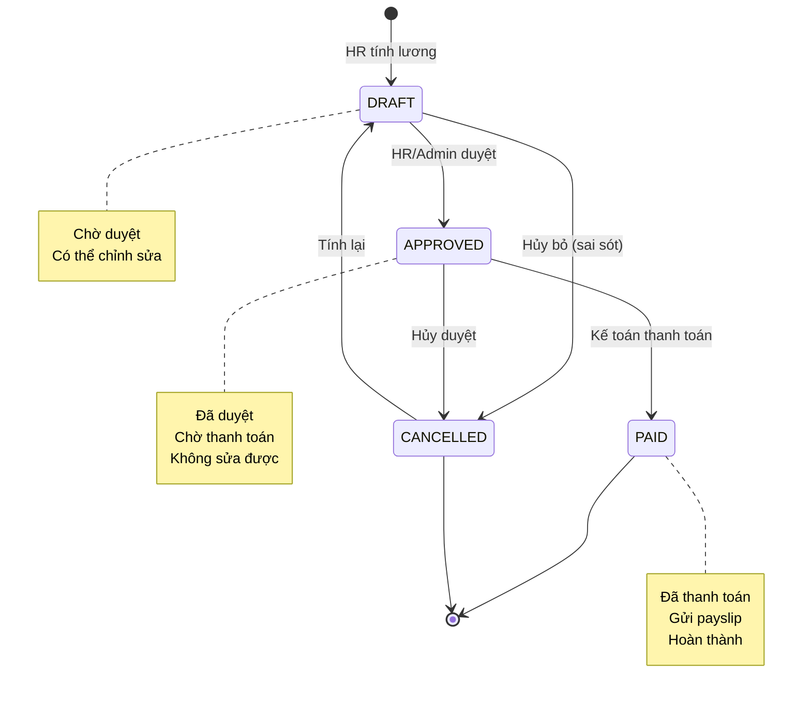
```mermaid
stateDiagram-v2
    [*] --> DRAFT: HR tính lương

    DRAFT --> APPROVED: HR/Admin duyệt
    DRAFT --> CANCELLED: Hủy bỏ (sai sót)

    APPROVED --> PAID: Kế toán thanh toán
    APPROVED --> CANCELLED: Hủy duyệt

    PAID --> [*]
    CANCELLED --> DRAFT: Tính lại
    CANCELLED --> [*]

    note right of DRAFT
        Chờ duyệt
        Có thể chỉnh sửa
    end note

    note right of APPROVED
        Đã duyệt
        Chờ thanh toán
        Không sửa được
    end note

    note right of PAID
        Đã thanh toán
        Gửi payslip
        Hoàn thành
    end note
```

### 6.6. Checklist Kiểm Thử

#### 6.6.1. Test Cases - Tính Lương

| ID      | Mô Tả                                | Input                           | Expected Output                      | Status |
| ------- | ------------------------------------ | ------------------------------- | ------------------------------------ | ------ |
| PAY-001 | Tính lương bác sĩ có hoa hồng        | DOCTOR, invoices=50M, daysOff=0 | Commission=2.5M, netSalary tính đúng | ⬜     |
| PAY-002 | Tính lương lễ tân không có hoa hồng  | RECEPTIONIST, daysOff=1         | Commission=0, no penalty             | ⬜     |
| PAY-003 | Tính lương có phạt nghỉ              | daysOff=5                       | Penalty=(5-2)×200k=600k              | ⬜     |
| PAY-004 | Tính lương nghỉ <= 2 ngày            | daysOff=2                       | Penalty=0                            | ⬜     |
| PAY-005 | Tính thưởng kinh nghiệm              | hireDate=2020-01-01, now=2026   | experienceBonus=6×200k=1.2M          | ⬜     |
| PAY-006 | Tính hàng loạt cho toàn bộ nhân viên | month=1, year=2026, all users   | Tạo payroll cho tất cả (trừ PATIENT) | ⬜     |

#### 6.6.2. Test Cases - Duyệt Lương

| ID      | Mô Tả                  | Input                          | Expected Output         | Status |
| ------- | ---------------------- | ------------------------------ | ----------------------- | ------ |
| PAY-011 | Duyệt lương DRAFT      | payrollId=555, status=DRAFT    | 200 OK, status=APPROVED | ⬜     |
| PAY-012 | Duyệt lương đã duyệt   | payrollId=555, status=APPROVED | 400 Đã duyệt rồi        | ⬜     |
| PAY-013 | Không phải ADMIN duyệt | Role=RECEPTIONIST              | 403 Forbidden           | ⬜     |

#### 6.6.3. Test Cases - Thanh Toán Lương

| ID      | Mô Tả                          | Input                          | Expected Output                 | Status |
| ------- | ------------------------------ | ------------------------------ | ------------------------------- | ------ |
| PAY-021 | Thanh toán lương đã duyệt      | payrollId=555, status=APPROVED | 200 OK, status=PAID, email sent | ⬜     |
| PAY-022 | Thanh toán lương DRAFT         | payrollId=555, status=DRAFT    | 400 Chưa được duyệt             | ⬜     |
| PAY-023 | Thanh toán lương đã thanh toán | payrollId=555, status=PAID     | 400 Đã thanh toán rồi           | ⬜     |

---

## 7. Chức Năng Quản Lý Kho Thuốc

### 7.1. Mô Tả Chức Năng

**Mục đích:** Quản lý tồn kho thuốc với cảnh báo tự động và xử lý hết hạn.

**Đặc điểm nổi bật:**

- ✅ Cron job tự động kiểm tra hàng ngày
- ✅ Cảnh báo tồn kho thấp
- ✅ Cảnh báo thuốc sắp hết hạn (30 ngày)
- ✅ Tự động đánh dấu thuốc hết hạn
- ✅ Pessimistic locking khi nhập/xuất kho

### 7.2. Activity Diagram - Quy Trình Cron Job Hàng Ngày


```mermaid
flowchart TD
    Start([Cron Trigger 00:00]) --> CheckExpired[Kiểm Tra Thuốc Hết Hạn]

    CheckExpired --> QueryExpired[SELECT * FROM Medicine<br/>WHERE expiryDate &lt; NOW<br/>AND status != 'EXPIRED']

    QueryExpired --> HasExpired{Có thuốc<br/>hết hạn?}

    HasExpired -->|Không| NextJob1[Chuyển Sang Job 08:00]

    HasExpired -->|Có| LoopExpired[Duyệt Qua Từng Thuốc]
    LoopExpired --> MarkExpired[UPDATE status = 'EXPIRED']
    MarkExpired --> LogExpiry[Ghi Log Audit]
    LogExpiry --> LoopExpired

    LoopExpired -->|Hết| SendExpiredAlert[ Gửi Cảnh Báo<br/>Danh Sách Thuốc Hết Hạn]
    SendExpiredAlert --> NextJob1

    NextJob1 --> CronTrigger08[Cron Trigger 08:00]
    CronTrigger08 --> CheckLowStock[Kiểm Tra Tồn Kho Thấp]

    CheckLowStock --> QueryLowStock[SELECT * FROM Medicine<br/>WHERE stock < minStock<br/>AND status = 'ACTIVE']

    QueryLowStock --> HasLowStock{Có thuốc<br/>tồn thấp?}

    HasLowStock -->|Không| NextJob2[Chuyển Sang Job 09:00]

    HasLowStock -->|Có| SendLowStockAlert[ Gửi Cảnh Báo Tồn Kho<br/>đến Admin/Pharmacist]
    SendLowStockAlert --> CreateNotification[Tạo In-app Notification]
    CreateNotification --> NextJob2

    NextJob2 --> CronTrigger09[Cron Trigger 09:00]
    CronTrigger09 --> CheckExpiring[Kiểm Tra Thuốc Sắp Hết Hạn]

    CheckExpiring --> QueryExpiring[SELECT * FROM Medicine<br/>WHERE expiryDate BETWEEN<br/>NOW AND NOW + 30 days]

    QueryExpiring --> HasExpiring{Có thuốc<br/>sắp hết hạn?}

    HasExpiring -->|Không| End([Kết Thúc])

    HasExpiring -->|Có| SendExpiringAlert[ Cảnh Báo Thuốc<br/>Sắp Hết Hạn trong 30 Ngày]
    SendExpiringAlert --> End

    style SendExpiredAlert fill:#000000
    style SendLowStockAlert fill:#000000
    style SendExpiringAlert fill:#000000
```

### 7.3. Sequence Diagram - Nhập Kho Thuốc với Locking

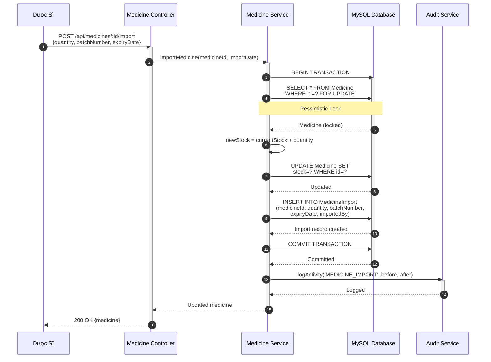
```mermaid
sequenceDiagram
    autonumber
    participant Pharmacist as Dược Sĩ
    participant Controller as Medicine Controller
    participant Service as Medicine Service
    participant DB as MySQL Database
    participant AuditService as Audit Service

    Pharmacist->>Controller: POST /api/medicines/:id/import<br/>{quantity, batchNumber, expiryDate}
    activate Controller

    Controller->>Service: importMedicine(medicineId, importData)
    activate Service

    Service->>DB: BEGIN TRANSACTION
    activate DB

    Service->>DB: SELECT * FROM Medicine<br/>WHERE id=? FOR UPDATE
    Note over Service,DB:  Pessimistic Lock
    DB-->>Service: Medicine (locked)

    Service->>Service: newStock = currentStock + quantity

    Service->>DB: UPDATE Medicine SET<br/>stock=? WHERE id=?
    DB-->>Service: Updated

    Service->>DB: INSERT INTO MedicineImport<br/>(medicineId, quantity, batchNumber,<br/>expiryDate, importedBy)
    DB-->>Service: Import record created

    Service->>DB: COMMIT TRANSACTION
    DB-->>Service: Committed
    deactivate DB

    Service->>AuditService: logActivity('MEDICINE_IMPORT', before, after)
    activate AuditService
    AuditService-->>Service: Logged
    deactivate AuditService

    Service-->>Controller: Updated medicine
    deactivate Service

    Controller-->>Pharmacist: 200 OK {medicine}
    deactivate Controller
```

### 7.4. Sequence Diagram - Cron Job Kiểm Tra Hết Hạn

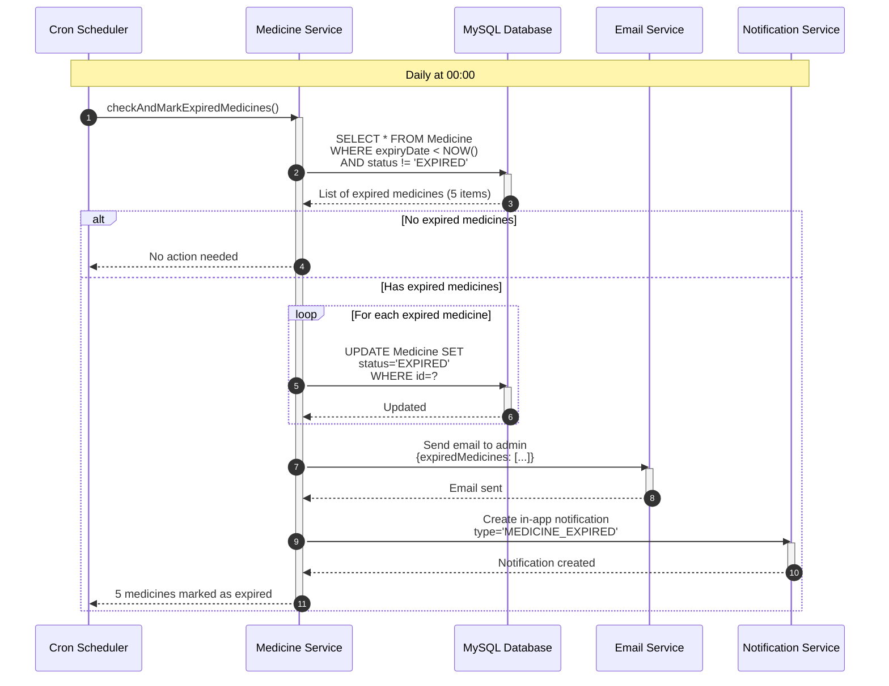
```mermaid
sequenceDiagram
    autonumber
    participant Cron as Cron Scheduler
    participant Service as Medicine Service
    participant DB as MySQL Database
    participant Email as Email Service
    participant Notification as Notification Service

    Note over Cron,Notification: Daily at 00:00

    Cron->>Service: checkAndMarkExpiredMedicines()
    activate Service

    Service->>DB: SELECT * FROM Medicine<br/>WHERE expiryDate < NOW()<br/>AND status != 'EXPIRED'
    activate DB
    DB-->>Service: List of expired medicines (5 items)
    deactivate DB

    alt No expired medicines
        Service-->>Cron: No action needed
    else Has expired medicines
        loop For each expired medicine
            Service->>DB: UPDATE Medicine SET<br/>status='EXPIRED'<br/>WHERE id=?
            activate DB
            DB-->>Service: Updated
            deactivate DB
        end

        Service->>Email: Send email to admin<br/>{expiredMedicines: [...]}
        activate Email
        Email-->>Service: Email sent
        deactivate Email

        Service->>Notification: Create in-app notification<br/>type='MEDICINE_EXPIRED'
        activate Notification
        Notification-->>Service: Notification created
        deactivate Notification

        Service-->>Cron: 5 medicines marked as expired
        deactivate Service
    end
```

### 7.5. Checklist Kiểm Thử

#### 7.5.1. Test Cases - Nhập/Xuất Kho

| ID      | Mô Tả                                 | Input                                       | Expected Output                          | Status |
| ------- | ------------------------------------- | ------------------------------------------- | ---------------------------------------- | ------ |
| MED-001 | Nhập kho thành công                   | medicineId=1, quantity=100, currentStock=50 | 200 OK, stock=150, import record created | ⬜     |
| MED-002 | Race condition - 2 nhập kho đồng thời | 2 pharmacists nhập cùng thuốc               | Cả 2 thành công, stock tăng chính xác    | ⬜     |
| MED-003 | Xuất kho khi đủ tồn                   | medicineId=1, exportQty=50, stock=100       | 200 OK, stock=50                         | ⬜     |
| MED-004 | Xuất kho khi không đủ                 | medicineId=1, exportQty=150, stock=100      | 400 Không đủ tồn kho                     | ⬜     |

#### 7.5.2. Test Cases - Cảnh Báo Tồn Kho

| ID      | Mô Tả                     | Input                 | Expected Output                   | Status |
| ------- | ------------------------- | --------------------- | --------------------------------- | ------ |
| MED-011 | Cảnh báo tồn kho thấp     | stock=5, minStock=10  | Email + notification gửi admin    | ⬜     |
| MED-012 | Không cảnh báo khi tồn đủ | stock=50, minStock=10 | Không có cảnh báo                 | ⬜     |
| MED-013 | Cron job 08:00 chạy đúng  | Trigger at 08:00      | Danh sách thuốc tồn thấp được gửi | ⬜     |

#### 7.5.3. Test Cases - Thuốc Hết Hạn

| ID      | Mô Tả                           | Input                                    | Expected Output              | Status |
| ------- | ------------------------------- | ---------------------------------------- | ---------------------------- | ------ |
| MED-021 | Đánh dấu thuốc hết hạn          | expiryDate < NOW()                       | status='EXPIRED', email sent | ⬜     |
| MED-022 | Cảnh báo thuốc sắp hết hạn      | expiryDate trong 30 ngày                 | Email cảnh báo               | ⬜     |
| MED-023 | Cron job 00:00 tự động đánh dấu | Trigger at 00:00                         | Thuốc hết hạn được đánh dấu  | ⬜     |
| MED-024 | Không cho kê thuốc đã hết hạn   | Create prescription với expired medicine | 400 Thuốc đã hết hạn         | ⬜     |

---

## 8. Tóm Tắt Kiểm Thử Tổng Thể

### 8.1. Ma Trận Vai Trò và Quyền Hạn

| Chức Năng         | ADMIN | DOCTOR        | RECEPTIONIST | PATIENT |
| ----------------- | ----- | ------------- | ------------ | ------- |
| Đặt lịch online   | ❌    | ❌            | ❌           | ✅      |
| Đặt lịch offline  | ✅    | ❌            | ✅           | ❌      |
| Check-in          | ✅    | ❌            | ✅           | ❌      |
| Khám bệnh         | ❌    | ✅            | ❌           | ❌      |
| Kê đơn thuốc      | ❌    | ✅            | ❌           | ❌      |
| Thanh toán        | ✅    | ❌            | ✅           | ❌      |
| Tính lương        | ✅    | ❌            | ❌           | ❌      |
| Quản lý kho thuốc | ✅    | ❌            | ✅           | ❌      |
| Xem báo cáo       | ✅    | ✅ (own only) | ❌           | ❌      |

### 8.2. Performance Benchmarks

| Chức Năng      | Expected Response Time | Max Concurrent Users | Notes                   |
| -------------- | ---------------------- | -------------------- | ----------------------- |
| Đặt lịch hẹn   | < 500ms                | 100                  | Với pessimistic locking |
| Kê đơn thuốc   | < 800ms                | 50                   | Nhiều thuốc = lâu hơn   |
| Thanh toán     | < 300ms                | 100                  | Transaction đơn giản    |
| Tính lương     | < 2s                   | 10                   | Tính hàng loạt lâu hơn  |
| Dashboard load | < 1s                   | 50                   | Nhiều aggregation       |

### 8.3. Danh Sách Kiểm Tra Go-Live

- [ ] **Database:**

  - [ ] All migrations executed successfully
  - [ ] Indexes created on foreign keys
  - [ ] Unique constraints verified
  - [ ] Backup strategy configured

- [ ] **Security:**

  - [ ] JWT secret configured
  - [ ] Password hashing verified (bcrypt)
  - [ ] CORS configured correctly
  - [ ] Rate limiting enabled
  - [ ] SQL injection protection tested

- [ ] **Email Service:**

  - [ ] SMTP credentials configured
  - [ ] Email templates tested
  - [ ] Unsubscribe links working

- [ ] **File Storage:**

  - [ ] Upload directory writable
  - [ ] File size limits configured
  - [ ] Image resizing working (avatars)

- [ ] **Cron Jobs:**

  - [ ] Cron jobs scheduled correctly
  - [ ] Log rotation configured
  - [ ] Error notifications enabled

- [ ] **Testing:**

  - [ ] All unit tests passing
  - [ ] Integration tests passing
  - [ ] Load testing completed
  - [ ] Security audit completed

- [ ] **Monitoring:**
  - [ ] Logging configured
  - [ ] Error tracking enabled (Sentry/similar)
  - [ ] Performance monitoring active
  - [ ] Database query monitoring

---

## 9. Ghi Chú Kỹ Thuật

### 9.1. Pessimistic Locking Strategy

**Khi nào sử dụng:**

- Đặt lịch hẹn (tránh trùng slot)
- Kê đơn thuốc (trừ tồn kho)
- Nhập/xuất kho thuốc
- Thanh toán (cập nhật invoice)

**Cú pháp:**

```typescript
await sequelize.transaction(async (t) => {
  const record = await Model.findOne({
    where: { id },
    lock: t.LOCK.UPDATE, // Pessimistic lock
    transaction: t,
  });

  // Modify and save
  record.field = newValue;
  await record.save({ transaction: t });
});
```

### 9.2. Transaction Isolation Levels

| Level           | Sử Dụng Cho          | Lý Do                                            |
| --------------- | -------------------- | ------------------------------------------------ |
| READ_COMMITTED  | Hầu hết transactions | Balance giữa consistency và performance          |
| REPEATABLE_READ | Báo cáo tài chính    | Đảm bảo dữ liệu không thay đổi trong transaction |
| SERIALIZABLE    | Tính lương hàng loạt | Tránh phantom reads                              |

### 9.3. Error Codes

| Code                     | Meaning                         | HTTP Status |
| ------------------------ | ------------------------------- | ----------- |
| ERR_INSUFFICIENT_STOCK   | Không đủ tồn kho thuốc          | 400         |
| ERR_SLOT_FULL            | Hết slot đặt lịch               | 400         |
| ERR_APPOINTMENT_CONFLICT | Trùng lịch hẹn                  | 409         |
| ERR_PAYMENT_EXCEEDS      | Thanh toán vượt quá số tiền     | 400         |
| ERR_PRESCRIPTION_LOCKED  | Không thể sửa đơn đã thanh toán | 400         |
| ERR_UNAUTHORIZED         | Không có quyền truy cập         | 403         |
| ERR_NOT_FOUND            | Không tìm thấy resource         | 404         |

---

## 10. Tài Liệu Tham Khảo

### 10.1. API Documentation

- Swagger/OpenAPI: `http://localhost:3000/api-docs`
- Postman Collection: [docs/API_TEST_GUIDE.md](API_TEST_GUIDE.md)

### 10.2. Database Schema

- ERD Diagram: (Tạo bằng dbdiagram.io hoặc DBeaver)
- Migration Files: `src/migrations/`

### 10.3. Code References

| Feature      | Controller                                                                  | Service                                                            | Model                                            |
| ------------ | --------------------------------------------------------------------------- | ------------------------------------------------------------------ | ------------------------------------------------ |
| Appointment  | [appointment.controller.ts](../src/controllers/appointment.controller.ts)   | [appointment.service.ts](../src/services/appointment.service.ts)   | [Appointment.ts](../src/models/Appointment.ts)   |
| Prescription | [prescription.controller.ts](../src/controllers/prescription.controller.ts) | [prescription.service.ts](../src/services/prescription.service.ts) | [Prescription.ts](../src/models/Prescription.ts) |
| Invoice      | [invoice.controller.ts](../src/controllers/invoice.controller.ts)           | [invoice.service.ts](../src/services/invoice.service.ts)           | [Invoice.ts](../src/models/Invoice.ts)           |
| Payroll      | [payroll.controller.ts](../src/controllers/payroll.controller.ts)           | [payroll.service.ts](../src/services/payroll.service.ts)           | [Payroll.ts](../src/models/Payroll.ts)           |

---
